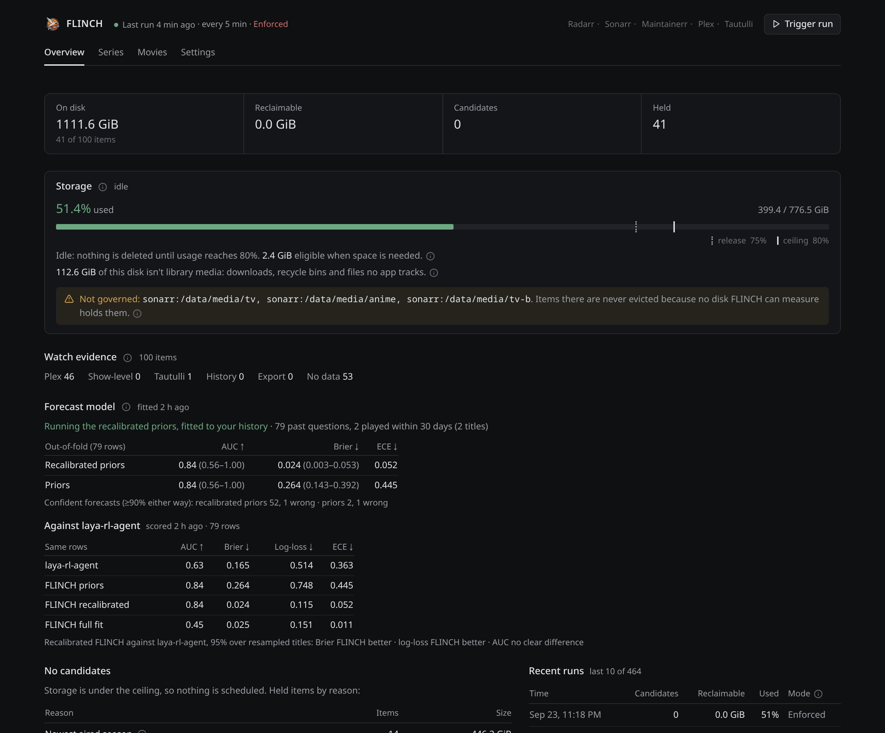
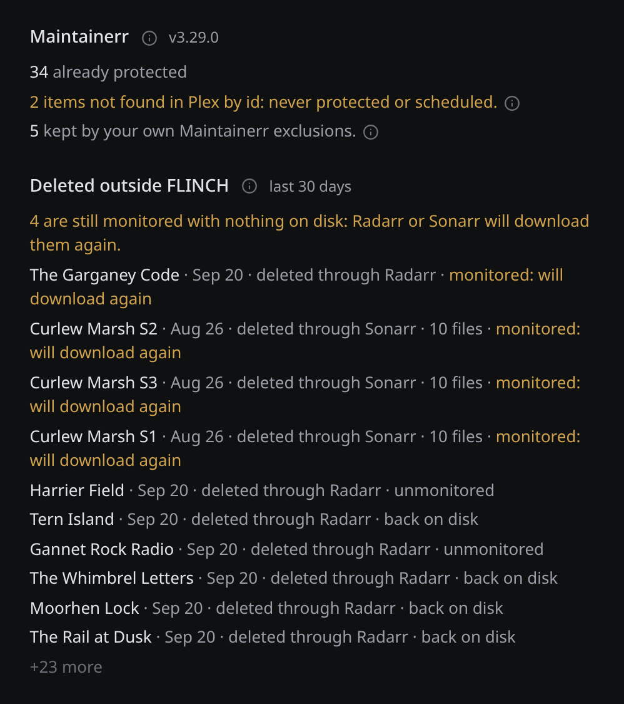
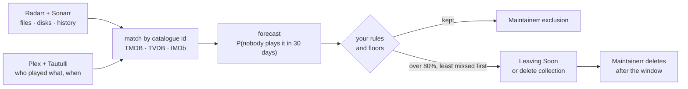
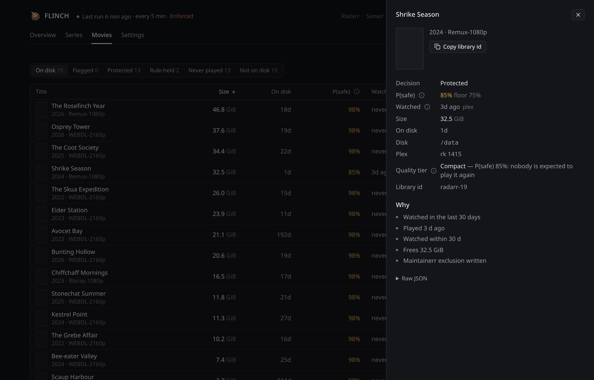
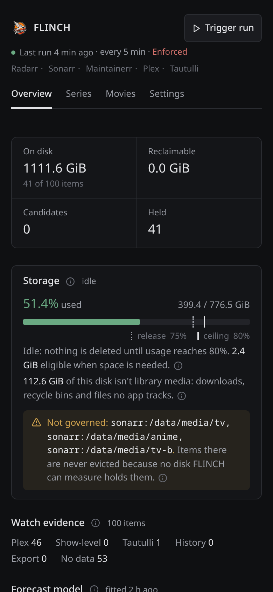

<p align="center">
  <picture>
    <source media="(prefers-color-scheme: dark)" srcset="frontend/public/logo-dark.png">
    
  </picture>
</p>

<h1 align="center">FLINCH</h1>

<p align="center">
  <b>Keeps your Plex library under 80% full, and never deletes what your household still wants.</b><br>
  A calibrated forecast for the *arr stack. It learns your household, checks itself every day,
  and leaves the deleting to Maintainerr.
</p>

<p align="center">
  <a href="LICENSE"></a>
  
  
  
</p>

<p align="center">
  
</p>

---

## ✨ What it does

- **Keeps every disk under a ceiling.** Below 80% nothing is deleted. When a disk
  crosses it, FLINCH frees space until the disk is back at 75%, then stops.
- **Frees what nobody will miss, first.** For every movie and season it forecasts
  the chance that nobody in the household plays it in the next 30 days, and frees
  the least-missed gigabytes first.
- **Learns your household.** The forecast comes from your own Plex, Tautulli,
  Radarr and Sonarr history: who played what, when, and what sat untouched.
- **Checks itself every day.** It replays its own past ("given what was known
  then, did anyone play this?"), scores itself on titles it never saw, and only
  switches to a learned model when that beats the built-in one.
- **Warns before anything unwatched goes.** A title nobody finished goes to a
  *Leaving Soon* row on the Plex home screen first. Play it and FLINCH takes it
  back.
- **Never touches what you protect.** Favorites, your keep tag, the newest aired
  season and your own Maintainerr exclusions are off limits. Missing evidence
  means keep.
- **Says where the space went.** Each disk shows how much of it isn't library
  media, and any space an eviction should have freed that something still holds.
- **Keeps Maintainerr tidy.** It releases its own exclusions for items that are
  gone, and lists deletions it did not make and which will download again.

FLINCH decides *what* goes. [Maintainerr](https://github.com/Maintainerr/Maintainerr)
does the deleting, on its own schedule.

<p align="center">
  
</p>

## 🧠 How it works



1. **Match.** Every title is joined across Radarr, Sonarr, Plex and Tautulli by
   catalogue id, never by name. An item that does not match is left alone.
2. **Forecast.** Each item gets P(safe), the chance nobody plays it in the next
   30 days, with the reasons behind it.
3. **Rules.** Deterministic rules decide what *may* go. The forecast only ranks
   what they allow, and nothing below the confidence floor is touched.
4. **Order.** Over the ceiling, items leave in order of expected regret per GiB,
   `(1 − P(safe)) / size`, so one large file nobody will watch goes before fifty
   small ones.
5. **Hand off.** Kept items get a Maintainerr exclusion. Evictions join a
   Maintainerr collection, and Maintainerr deletes them after its window. Every
   write is read back to confirm it landed.

The long version, down to recycle-bin accounting, is in
[docs/how-it-works.md](docs/how-it-works.md).

## 📊 Accuracy you can check

FLINCH ships the harness that grades it. `flinch-fit` asks any
[System One](https://typesafe.ai/blog/introducing-system-one-models-and-jev)
decision model the same question about the same state, and scores every answer
side by side. On one household, 79 past questions over 13 titles (2026-09-23):

| Model | AUC ↑ | Brier ↓ | Log-loss ↓ | ECE ↓ |
| --- | --- | --- | --- | --- |
| [JEV](https://typesafe.ai/blog/introducing-system-one-models-and-jev) (TypeSafe, cloud) | 0.734 | 0.069 | 0.294 | 0.228 |
| [Laya](https://huggingface.co/convaiinnovations/laya) (local, CPU) | 0.578 | 0.169 | 0.522 | 0.368 |
| **FLINCH**, scored on titles it never trained on | **0.838** | **0.024** | **0.115** | **0.052** |

FLINCH's probabilities beat both: on Brier and log-loss the 95% intervals are
clear of zero. It also leads on ranking (AUC), but with only 2 of the 13 titles
played, that lead is not yet significant. The comparison reruns as the history
grows. Method, commands and the full table are in
[docs/how-it-works.md](docs/how-it-works.md#accuracy-you-can-check).

## 🚀 Try the demo

No homelab needed. The demo is a real FLINCH snapshot with every title renamed:

```bash
docker build -t flinch -f deploy/Dockerfile .
docker run --rm -p 7911:7911 -e FLINCH_STATE_DIR=/tmp/demo flinch sh -c 'flinch-demo && flinch-web'
```

Then open <http://localhost:7911>.

<p align="center">
  
</p>

## 📦 Install

You need Radarr, Sonarr, Plex and Maintainerr 3.10 or newer; Tautulli is
optional. FLINCH runs as two small pods on Kubernetes: one image of about 35 MB,
no GPU.

1. **Build and push the image** to a registry your cluster can pull from:
   ```bash
   docker build -t registry.example.com/flinch:latest -f deploy/Dockerfile .
   docker push registry.example.com/flinch:latest
   ```
2. **Configure** the namespace, image and service URLs in
   [`deploy/kustomization.yaml`](deploy/kustomization.yaml).
3. **Add your API keys** as the Secret `flinch-secrets`:
   ```bash
   kubectl -n media create secret generic flinch-secrets \
     --from-literal=RADARR_API_KEY=… --from-literal=SONARR_API_KEY=…
   ```
   Plex goes in the same Secret or in **Settings → Plex** later; Tautulli and a
   Maintainerr key are optional. See [Configure](deploy/README.md#configure).
4. **Install:** `kubectl apply -k deploy/`
5. **Open the UI.** Enforcement starts **off**: FLINCH plans and logs every write
   it would make, and sends nothing.
6. **Set up Maintainerr** (two delete collections and two *Leaving Soon*
   collections), then turn on **Settings → Safety → Enforcement**.

The [install guide](deploy/README.md) covers each step, the exact Maintainerr
settings, running as a CronJob, and keeping your own values out of git.

## 🛡️ Safety

- **Off until you say so.** A fresh install only plans and logs.
- **Rules beat the model.** Favorites, the keep tag (`flinch-keep` by default: a
  Radarr/Sonarr tag, a Plex label or a Plex collection), the newest aired
  season, anything played in the last 30 days and your own Maintainerr
  exclusions are never evicted, whatever the forecast says.
- **Missing evidence keeps.** An item FLINCH cannot match, a watch source it
  could not read in full, or a disk it cannot measure means *keep*, never
  *delete*.
- **Two floors.** An item must clear both the model's floor and yours
  (P(safe) ≥ 0.75 by default) before it can even be a candidate.
- **Deletes only through Maintainerr.** FLINCH never deletes a file itself and
  never writes to Radarr or Sonarr. Every Maintainerr write is read back; a
  failed one is retried, never assumed.
- **Per disk, never pooled.** Freeing the TV disk never counts toward a full
  movie disk, and bytes still in a recycle bin are credited, so nothing is
  deleted twice for the same gap.
- **Space that never frees is reported, not chased.** Bytes a seeding torrent
  or a snapshot still holds after an eviction are reported and stay credited
  for up to 14 days, so FLINCH evicts nothing more for them.

The web UI has no login. Keep it on your LAN or behind your proxy's auth; see
[Security](deploy/README.md#security).

<p align="center">
  
</p>

## 🔌 Extras

- **Ask FLINCH from anywhere.** `POST /v1/systemone` answers "is this safe to
  delete?" in TypeSafe's System One format, so Home Assistant, n8n or the
  TypeSafe SDK can ask it the way they ask JEV.
  [Details](docs/how-it-works.md#ask-flinch-like-any-system-one-model).
- **Grade any model.** `flinch-fit --against <url>` benchmarks a System One
  server on your own history.
  [Details](docs/how-it-works.md#accuracy-you-can-check).
- **Steer what comes in.** Per-item quality-tier advice for Recyclarr
  (`premium` / `compact`).
  [Details](docs/how-it-works.md#recyclarr-steering-what-comes-in).

## 🚧 Status

- **516 tests pass**, with table-driven cases and property tests on everything
  that decides a deletion: eviction order, watermark latching, recycle-bin
  credit and the freed-bytes check, identity joins, Maintainerr sync and
  exclusion releases, Leaving Soon routing and the forecast's no-leakage rules.
- **Running on one homelab** with enforcement on since 2026-09-22. All 34
  keep-exclusions FLINCH wrote are found in Maintainerr every cycle, and the
  daily fit has adopted the recalibrated model (out-of-fold AUC 0.84, Brier
  0.024).
- **TV on NFS can go ungoverned.** On that homelab, Sonarr's disk report left
  out all three of its NFS mounts, so FLINCH cannot measure those disks and never
  evicts from them. The Storage card says so.
- **Every known limit fails closed.** One Radarr and one Sonarr instance; Plex is
  required to match items. The full list is in
  [docs/how-it-works.md](docs/how-it-works.md#known-limits).

## 🧑‍💻 Development

```bash
cargo test --workspace                     # the whole suite
cd frontend && npm ci && npm run build     # the UI, into frontend/dist
cd ..
FLINCH_STATE_DIR=/tmp/flinch-demo cargo run -p flinch-web --bin flinch-demo
FLINCH_STATE_DIR=/tmp/flinch-demo FLINCH_WEB_DIR=frontend/dist cargo run -p flinch-web --bin flinch-web
```

| Path | What it is |
| --- | --- |
| `crates/flinch-archive` | the daemon (`flinch-arrd`), the forecast and its daily fit (`flinch-fit`), and the offline planner (`flinch-archive`) |
| `crates/flinch-web` | the UI server, its JSON API, the System One endpoint and `flinch-demo` |
| `frontend/` | the React UI, built into the image |
| `deploy/` | the Dockerfile, kustomize manifests, install guide and Recyclarr config |
| `docs/` | how it works, and the screenshots above |

## License

MIT, see [LICENSE](LICENSE).
