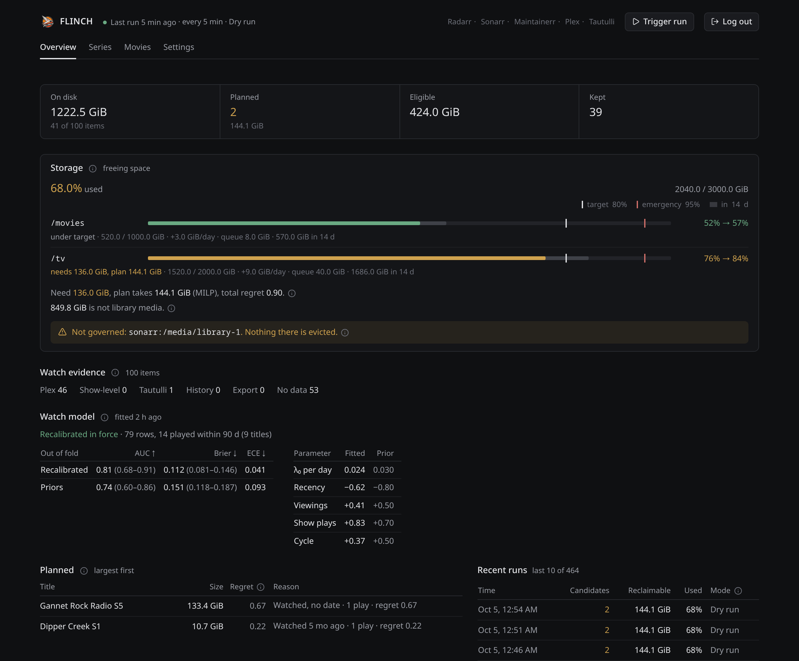
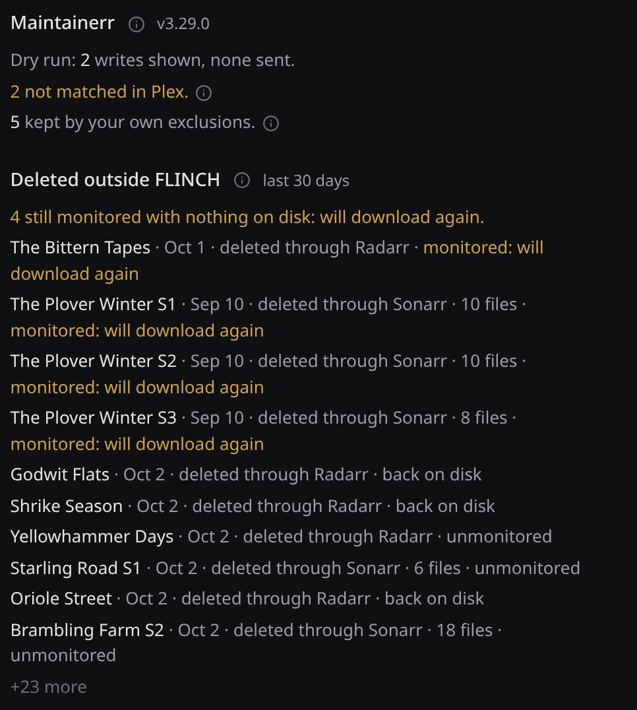
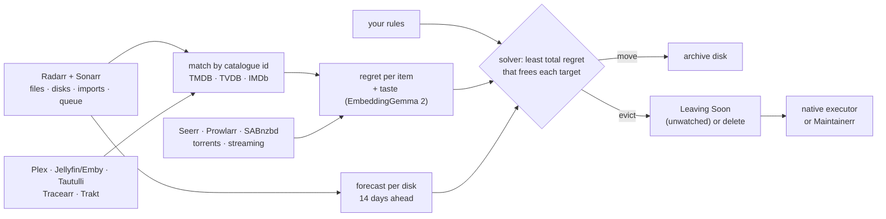
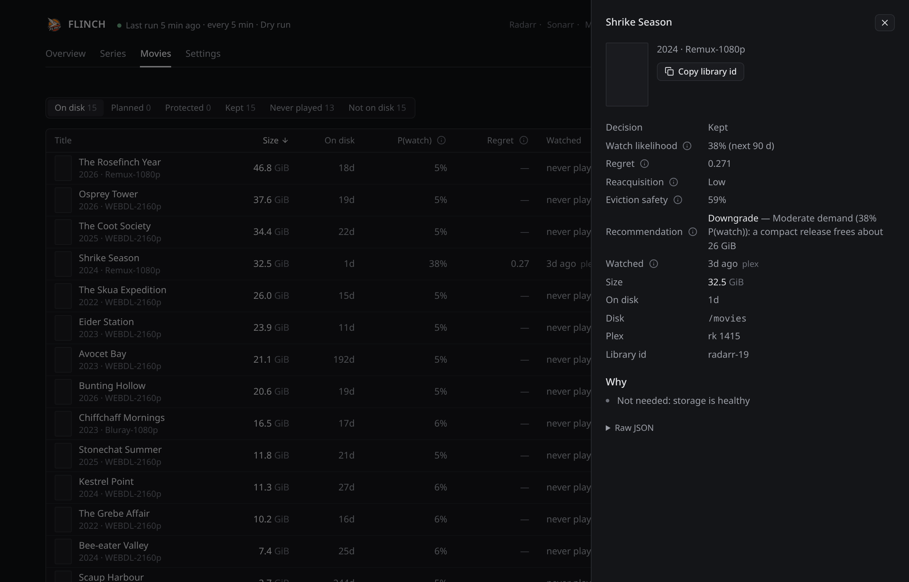
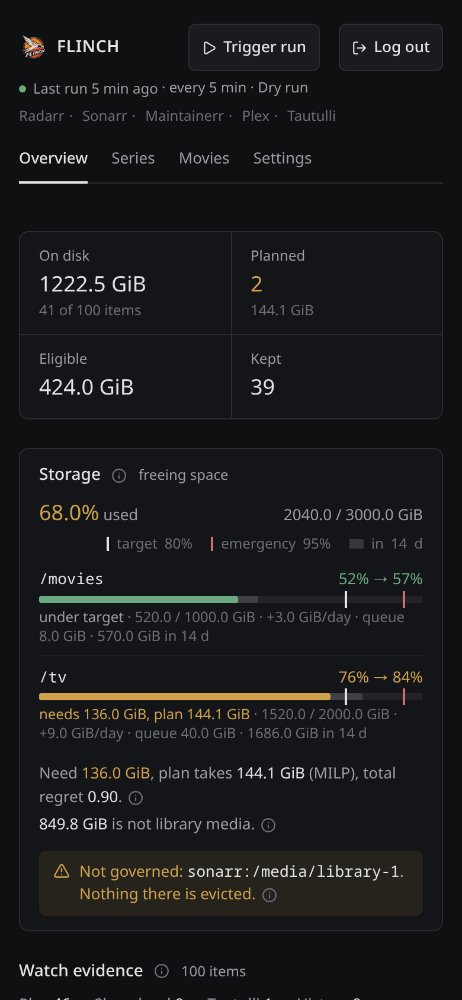

<p align="center">
  <picture>
    <source media="(prefers-color-scheme: dark)" srcset="frontend/public/logo-dark.png">
    
  </picture>
</p>

<h1 align="center">FLINCH</h1>

<p align="center">
  <b>Keeps each media disk under 80% full by freeing what your household will miss least.</b><br>
  A storage planner and library janitor for the *arr stack, and an alternative to Maintainerr
  and Recyclarr in one: it forecasts every disk, picks the evictions with the least expected
  regret, warns before anything unwatched goes, deletes (itself or through Maintainerr), and keeps
  your quality profiles in sync with TRaSH-Guides.
</p>

<p align="center">
  <a href="https://github.com/tobhoster/flinch/actions/workflows/ci.yml"></a>
  <a href="https://github.com/tobhoster/flinch/actions/workflows/security.yml"></a>
  <a href="LICENSE"></a>
  
  
  
</p>

<p align="center">
  
</p>

---

## ✨ What it does

Everything below the first group is optional and off until you switch it on.
Dry run is on by default: a fresh install writes its plan and logs every write
it would make, and sends nothing.

### Plans what goes

- **Plans ahead, per disk.** Nothing is deleted while a disk's two-week
  forecast stays 50 GiB under 80%; then only enough to get back under it.
- **Frees what nobody will miss, first.** An exact solver picks the set of
  evictions with the least expected regret: the chance anyone plays it within
  90 days, how hard it is to download again (size, seeders, usenet retention,
  or whether it streams on a service you have), and who asked for it.
- **Checks its forecast every day.** A daily fit replays the household's own
  past and adopts a fitted P(watch) only when it beats the hand-set priors on
  titles it never saw.
- **Treats finished as finished.** A title everyone who started it has
  finished is cheap to lose, however recently it ended. A season counts as
  finished only when every episode still on disk was watched.
- **Learns what you'd watch.** EmbeddingGemma 2 runs inside FLINCH on the CPU
  (a pure-Rust candle port, no model server). Titles nobody opened yet are
  compared with what each active viewer actually played, and reasons name the
  look-alikes ("like *Hereditary*, *The Conjuring*, unplayed here").
  [Details](deploy/README.md#taste-embeddings-embeddinggemma-2).
- **Takes your rules as hard constraints.** Keep, keep for N days after a
  request, keep the newest N seasons or the first season, prefer or must
  evict: by library, folder, disk, tag, Plex section, requester, theme, genre,
  quality, size, age, last play or P(watch). Each change is previewed as a
  diff of the plan before it is saved.
- **Archives instead of deleting.** With an archive disk, a movie or a whole
  series moves to an archive root folder first; deletion covers only what
  doesn't fit.

### Deletes it safely, with or without Maintainerr

- **Warns before anything unwatched goes.** A title nobody finished goes to a
  *Leaving Soon* row first, on Plex or on Jellyfin/Emby, sorted by leave date,
  with the dates in its summary and, if you like, a "Leaves Oct 23" badge on
  the poster. Play it and FLINCH takes it back.
- **Deletes itself or hands over to Maintainerr.** The native executor
  deletes through Radarr and Sonarr after the window, re-checks every watch
  source right before each delete, cleans up the Seerr request, removes the
  torrent too, and can restore anything it deleted in the last 30 days.
  Prefer Maintainerr? It stays the default.
- **Lets torrents seed.** Items still seeding toward their goal stay, and an
  item whose files a torrent hardlinks is not counted as freed space until the
  torrent goes.
- **Finds duplicate copies.** Movies held twice (Plex versions, two
  libraries, two Radarrs) with the copy to keep, and big folders no item owns;
  you confirm, FLINCH removes the rest.
- **Never touches what you protect.** Favorites, your keep tag, keep
  collections, your own Maintainerr exclusions and anything on disk less than
  30 days are off limits. Missing evidence means keep.

### Keeps quality in check (instead of Recyclarr)

- **TRaSH-Guides sync, with a preview.** Custom formats, quality profiles
  with score overrides (absolute or relative) and quality sizes, from
  TRaSH-Guides or a Profilarr database, pinned to a commit, shown change by
  change with the GiB it would free or cost on each disk, written only when
  you apply. Presets add a compact profile, stop endless upgrades and set a
  language preference.
- **Acts on quality advice.** Large titles the household seldom watches move
  to the compact profile, only when a release at least 30% smaller exists, a
  few a day.
- **Stops upgrade loops.** Titles re-grabbed again and again are flagged, and
  can be unmonitored or have upgrades turned off.
- **Upgrades what will be watched.** Titles below their profile's cutoff are
  searched likeliest-watched first, only where the disk forecast has room.

### Knows the household

- **Reads every watch source.** Plex, Tautulli, Jellyfin/Emby, Tracearr and
  Trakt, joined by TMDB/TVDB/IMDb id, never by title. Named guests can be left
  out of the evidence.
- **Tells people.** Discord, ntfy, Apprise or a webhook hear about Leaving
  Soon, deletions, problems and a daily digest. Whoever requested a title is
  told personally, and a weekly newsletter lists what's leaving.
- **Lets the household decide, without a login.** Signed, expiring links keep
  a title with one click; requesters can ask to remove their own titles, and
  you approve.
- **Shows where the disk goes.** Per disk, how much isn't library media and
  what an eviction should have freed; per theme, how big it is and how much of
  it was played this year.
- **Turns off the tap.** Flags what's coming in that nobody will watch (cold
  or abandoned monitored shows, cold requests). While a disk is over target it
  can unmonitor the future seasons and switch off the import lists you ticked.
- **Search by meaning.** The Movies and Series tables find titles by
  description ("dinosaurs", "slow-burn horror"), not just by name.
- **Several Radarrs and Sonarrs.** HD beside 4K, anime beside the rest; each
  instance keeps its own disks, archive root, compact profile and TRaSH sync.
- **Single sign-on.** Authelia, Authentik, Keycloak or any OpenID Connect
  provider, beside or instead of the password.

FLINCH decides *what* goes and, with the native executor, deletes it;
[Maintainerr](https://github.com/Maintainerr/Maintainerr) can still do the
deleting instead (Settings → Executor).

<p align="center">
  
</p>

## 🧠 How it works


```mermaid
flowchart LR
    ARR["Radarr + Sonarr<br/>files · disks · imports · queue"] --> ID["match by catalogue id<br/>TMDB · TVDB · IMDb"]
    PX["Plex · Jellyfin/Emby · Tautulli<br/>Tracearr · Trakt"] --> ID
    ID --> R["regret per item<br/>+ taste (EmbeddingGemma 2)"]
    EXT["Seerr · Prowlarr · SABnzbd<br/>torrents · streaming"] --> R
    ARR --> FC["forecast per disk<br/>14 days ahead"]
    RU["your rules"] --> S
    R --> S{"solver: least total regret<br/>that frees each target"}
    FC --> S
    S -- "move" --> AR["archive disk"]
    S -- "evict" --> LS["Leaving Soon<br/>(unwatched) or delete"]
    LS --> M["native executor<br/>or Maintainerr"]
```

1. **Match.** Every title is joined across the *arrs and the media servers by
   catalogue id, never by name. An item that does not match is left alone.
2. **Forecast.** Each disk's use is projected 14 days ahead. The target is how
   far that lands over 80%, plus 50 GiB. A target of zero on every disk means
   nothing happens this cycle.
3. **Regret.** Each item's regret is P(played within 90 days) × the cost to
   download it again × how much the household claims it.
4. **Exclude.** Pinned items, items in their 30-day grace period, items no
   media server can address, items with no watch evidence, items still
   seeding and items your rules keep never compete. Items nobody played
   compete only when you allow it.
5. **Solve.** An exact solver picks the cheapest set that covers each disk's
   target (moving to an archive disk first when there is one), taking a show's
   seasons in order. At 95% full it switches to a fast greedy pick.
6. **Act.** The plan goes to `eviction-plan.json` every cycle. With dry run
   off, unwatched items go to Leaving Soon and leave after its window;
   finished ones leave at once. The native executor or Maintainerr does the
   deleting. Every write is read back.

The long version, with the formulas, is in
[docs/how-it-works.md](docs/how-it-works.md).

## 🚀 Try the demo

No homelab needed. The demo is a snapshot of a real library with every title
renamed and every size, date and id randomized:

```bash
docker run --rm -p 127.0.0.1:7911:7911 -e FLINCH_STATE_DIR=/tmp/demo \
  -e FLINCH_WEB_USERNAME=demo -e FLINCH_WEB_PASSWORD=demo \
  ghcr.io/tobhoster/flinch:0.3.0 sh -c 'flinch-demo && flinch-web'
```

Then open <http://localhost:7911> and log in as `demo` with the password `demo`.

<p align="center">
  
</p>

## ⬆️ Upgrading from 0.1.x

0.2.0 replaces the UI's token with a username and password. Before you change
the image tag in production (if you run `latest`, pin `0.1.1` first: `latest`
moves to 0.2.0 when it is published, and any restart pulls it):

1. **Add the login** to `flinch-secrets`: `FLINCH_WEB_USERNAME` and
   `FLINCH_WEB_PASSWORD`
   ([how, without a password in your shell history](deploy/README.md#upgrading-from-the-access-token)).
2. **Apply the 0.2.0 manifests**, which pass the two new keys to `flinch-web`:
   update your checkout to the release (`git fetch --tags && git checkout
   v0.3.0`), set `newTag: "0.3.0"` in your overlay if you have one, and run
   `kubectl apply -k`. An overlay reads `../base` from the checkout it sits in,
   so moving `newTag` alone runs 0.2.0 on 0.1.1's manifests, which never pass
   the login to the pod.
3. **Log in.** Until the Secret has both keys and `flinch-web` runs the 0.2.0
   manifests, the UI says "No login set" (added the keys after the rollout?
   `kubectl -n media rollout restart deploy/flinch-web`). Nothing is left open
   meanwhile, and the API key keeps working.

Automations keep working unchanged: `FLINCH_WEB_TOKEN` is now the API key,
still accepted as `Authorization: Bearer` and now as `X-Api-Key` too. No state
migration. Every behaviour change is toward keeping; these are the ones you
may notice on the first cycle:

- With no *Leaving Soon* collection named, unwatched items and never-played
  reclaim are **held**, not sent to a delete collection.
- A movie read as watched only from Plex's view stamp (no counted view), or
  only from Tautulli streams with no readable percentage, now counts as
  started: it waits for never-played reclaim and a *Leaving Soon* warning.
- An item no watch source reported on is kept; never-played reclaim no longer
  reaches it.
- An unwatched item FLINCH put in a delete collection earlier is taken back
  out and moves to *Leaving Soon*, whose window starts then. One in a delete
  collection FLINCH has no record of adding it to gets a FLINCH exclusion
  until you take it out.
- Adopting a fitted model can no longer make an item eligible that the
  hand-set priors hold.

The full list is in the [0.2.0 release notes](https://github.com/tobhoster/flinch/releases/tag/v0.3.0).

## 📦 Install

You need Radarr and Sonarr, and Plex or Jellyfin/Emby. Maintainerr 3.10 or
newer is needed only if it does the deleting (the default; the native executor
does it without). Tautulli, Tracearr, Trakt, Seerr, Prowlarr, SABnzbd,
qBittorrent/Transmission and TMDB are optional. FLINCH runs as two small pods
on Kubernetes from one published image (`ghcr.io/tobhoster/flinch`, amd64 and
arm64, no GPU). With taste embeddings on, the daemon downloads about 580 MB
of EmbeddingGemma 2 weights to its state volume once and needs up to 1 GiB of
memory.

1. **Configure** the namespace and service URLs in
   [`deploy/kustomization.yaml`](deploy/kustomization.yaml).
2. **Create the Secret** `flinch-secrets` from a file only you can read, so no
   key lands in your shell history:
   ```bash
   install -m 600 /dev/null flinch.env                              # readable only by you
   echo "FLINCH_WEB_TOKEN=$(openssl rand -hex 32)" >> flinch.env   # the API key, for automations
   $EDITOR flinch.env   # add FLINCH_WEB_USERNAME=..., FLINCH_WEB_PASSWORD=...,
                        # RADARR_API_KEY=..., SONARR_API_KEY=..., one per line
   kubectl -n media create secret generic flinch-secrets --from-env-file=flinch.env
   rm flinch.env
   ```
   `FLINCH_WEB_USERNAME` and `FLINCH_WEB_PASSWORD` are the UI's login; write
   every value without quotes. Plex goes in the same Secret or in
   **Settings → Plex** later; the other services' keys are optional. See
   [Configure](deploy/README.md#configure). Already running FLINCH with only
   the token? See [Upgrading from the access token](deploy/README.md#upgrading-from-the-access-token).
3. **Install:** `kubectl apply -k deploy/`
4. **Open the UI:** `kubectl -n media port-forward svc/flinch-web 7911:7911`,
   then <http://localhost:7911>, and log in with that username and password
   (see [Reach the UI](deploy/README.md#reach-the-ui)).
   Dry run starts **on**: FLINCH writes its plan and logs every write it would
   make, and sends nothing.
5. **Choose who deletes.** Either set up Maintainerr (two delete collections
   and two *Leaving Soon* collections), or switch **Settings → Executor** to
   native. Then turn off **Settings → Planner → Dry run**.

The [install guide](deploy/README.md) covers each step, the exact Maintainerr
settings, the native executor, every optional integration, publishing the UI
over HTTPS, running as a CronJob, building your own image, and keeping your
own values out of git.

## 🛡️ Safety

- **Off until you say so.** Dry run is on by default: a fresh install only
  writes its plan and logs.
- **Pins beat the plan.** Favorites, the keep tag (`flinch-keep` by default: a
  Radarr/Sonarr tag, a Plex label or a Plex collection), keep collections and
  your own Maintainerr exclusions are never evicted. Neither is anything on
  disk less than 30 days.
- **Missing evidence keeps.** An item FLINCH cannot match, an item no watch
  source reported on, a watch source it could not read in full, or a disk it
  cannot measure means *keep*, never *delete*.
- **No warning, no unwatched deletion.** Anything nobody finished leaves only
  through *Leaving Soon* (one exception: see
  [Known limits](docs/how-it-works.md#known-limits)). With no *Leaving Soon*
  collection named, such items are held rather than sent to a delete
  collection.
- **Nothing unplayed unless you allow it.** Items nobody has played compete
  only once you turn on **Settings → Planner → Never played**.
- **Seasons leave in order.** A show's watched seasons go from the first,
  unplayed ones from the last, and a season that must stay keeps every season
  due to leave after it.
- **Deletes through Maintainerr, or itself only when you choose.** By default
  FLINCH never deletes a file itself. With the native executor (Settings →
  Executor) it deletes through Radarr and Sonarr, after a Plex Leaving Soon
  window for anything nobody finished and a last look at Plex right before
  each delete; deletes of the last 30 days can be restored. Other writes to
  Radarr or Sonarr happen only when you switch them on (the TRaSH quality
  sync, quality actions). Every write is read back; a failed one is retried
  or reported, never assumed.
- **Per disk, never pooled.** Freeing the TV disk never counts toward a full
  movie disk, and bytes still in a recycle bin are credited, so nothing is
  deleted twice for the same gap.
- **Space that never frees is reported, not chased.** Bytes a seeding torrent
  or a snapshot still holds after an eviction are reported and stay credited
  for up to 14 days, so FLINCH evicts nothing more for them.

The UI asks for a username and password (`FLINCH_WEB_USERNAME`,
`FLINCH_WEB_PASSWORD`) or a single sign-on, because whoever can save Settings
can turn off dry run; automations use the API key (`FLINCH_WEB_TOKEN`)
instead. Serve it over HTTPS and keep it off the internet; see
[Security](deploy/README.md#security) and [SECURITY.md](SECURITY.md).

<p align="center">
  
</p>

## 🚧 Status

- **Tested** with table-driven cases and property tests on everything that
  decides a deletion: the disk forecast, regret, the solver and its season
  order, recycle-bin credit and the freed-bytes check, identity joins,
  Maintainerr sync and exclusion releases, Leaving Soon routing and the
  forecast's no-leakage rules, plus the API's login, session and API key
  checks, the settings bounds and the response-size limit.
- **Checked on every change**: nothing merges into `main` without the tests,
  CodeQL and the Security workflow (secrets, dependency advisories and
  licenses, workflow linting, and a scan and smoke test of the image).
- **In production on one homelab**, handing items to Maintainerr since
  2026-09-22. The regret planner is newer and unreleased, and the features
  added since (native executor, Jellyfin/Emby shelf, TRaSH sync, quality
  actions, archive tier, duplicates, household links, several *arr
  instances, more watch sources) are tested against simulated servers only so
  far: keep dry run on and read the logged writes before switching any of them
  on. The Watch model card on the Overview shows whether a fitted P(watch) or
  the hand-set priors run.
- **TV on NFS can go ungoverned.** On that homelab, Sonarr's disk report left
  out all three of its NFS mounts, so FLINCH cannot measure those disks and never
  evicts from them unless they are mounted into the daemon. The Storage card
  says so.
- **Known limits.** Two narrow cases can delete without a warning (Plex's own
  watched counts with a deleted episode still in its trash; episodes numbered
  differently in Plex and Sonarr). The rest fail closed: with several Radarr
  or Sonarr instances, one instance down stops the cycle. The full list is in
  [docs/how-it-works.md](docs/how-it-works.md#known-limits).

## 🧑‍💻 Development

Building needs CMake, make, a C++ compiler and libclang: the HiGHS solver
compiles from source.

```bash
cargo fmt --all                            # the style in rustfmt.toml
cargo test --workspace --locked            # the whole suite
cd frontend && npm ci && npm run build     # the UI, into frontend/dist
cd ..
FLINCH_STATE_DIR=/tmp/flinch-demo cargo run -p flinch-web --bin flinch-demo
FLINCH_STATE_DIR=/tmp/flinch-demo FLINCH_WEB_DIR=frontend/dist \
  FLINCH_WEB_USERNAME=demo FLINCH_WEB_PASSWORD=demo cargo run -p flinch-web --bin flinch-web
```

[CONTRIBUTING.md](CONTRIBUTING.md) has the rules for changes; report security
problems privately, as [SECURITY.md](SECURITY.md) describes.

| Path | What it is |
| --- | --- |
| `crates/flinch-archive` | the daemon (`flinch-arrd`), the forecast and its daily fit (`flinch-fit`), and the offline planner (`flinch-archive`) |
| `crates/flinch-web` | the UI server, its JSON API and `flinch-demo` |
| `frontend/` | the React UI, built into the image |
| `deploy/` | the Dockerfile, kustomize manifests (with an optional HTTPS Ingress) and install guide |
| `docs/` | how it works, and the screenshots above |

## License

MIT, see [LICENSE](LICENSE).
