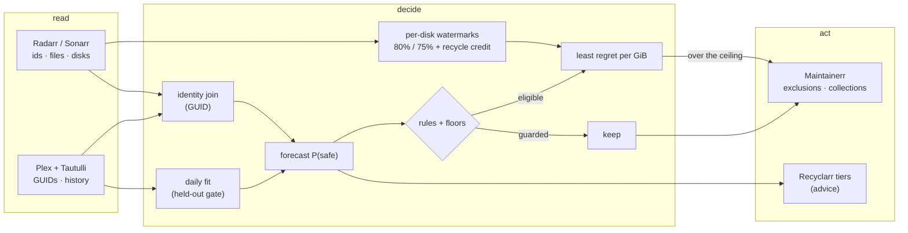

# How FLINCH works

The [README](../README.md) is the short version. This page is the long one: how
disks are measured, how items are matched across apps, how the forecast is
checked, and what every part of the stack is asked for.

## Storage governance: stay under 80%

The daemon measures every disk that holds a library and governs each one with
two watermarks — the Kubernetes image-GC high/low pattern:

- **Below the ceiling (80%), nothing is deleted.** A library under budget is
  doing its job; deleting a safe-looking item there buys nothing.
- **Crossing the ceiling latches eviction for that disk.** FLINCH frees the
  **least expected regret per GiB first** — `(1 − P(safe)) / size`, so one large
  item nobody will watch goes before fifty small ones — until the disk is back at
  the **release mark (75%)**, then stops. The gap between the two is the
  hysteresis: equal thresholds would delete one item after every download.

What "a disk" means is taken seriously, because each mistake here deletes the
wrong thing:

- **Only library disks count.** `/api/v3/diskspace` lists every mount in the
  *arr container (`/`, `/config`, …); only the mounts that host a root folder are
  governed, so a full config volume never evicts media.
- **A root folder is checked against the disk it maps to.** Each app also
  reports the free space at the root folder itself; when that disagrees with
  the mount its path falls under, the folder lives on a disk the app does not
  list, and it is reported as ungoverned instead of measured against the
  container's `/`. (Seen live: Sonarr listed none of its three NFS mounts.)
- **Per disk, never pooled.** Freeing the TV disk does not relieve a full movie
  disk; each item is attributed to its disk through its own app and path, and a
  share mounted at `/movies` in Radarr and `/tv` in Sonarr is recognised as one
  filesystem, so its goal is not counted twice.
- **The recycle bin is credited.** Radarr/Sonarr delete into a recycle bin on the
  same disk, so freed space shows up late. FLINCH keeps a ledger of what it
  handed over and credits those bytes against the goal until the bin's window
  (read live from each app) passes and the disk shows them freed — otherwise
  every cycle in that window would evict a second batch for the same gap.
- **Freed space is checked, not assumed.** After an eviction's recycle-bin
  window, FLINCH checks that the disk dropped by the item's size, and keeps
  crediting the bytes for a 2-day grace. If no drop shows by then, the eviction
  is *held*: something else still holds the bytes, typically a torrent seeding
  the same hardlinked file, or a filesystem snapshot. Held bytes stay credited
  against the goal, so nothing more is evicted for them, and are reported, for
  up to 14 days after they were marked held or until the drop shows (then the
  credit ends). An eligible item on such a disk says why it waits: "held while
  /movies waits for space handed over earlier that the disk has not released".
  Downloads in flight can hide a drop for a while: the error is then a held
  report and less eviction, never more. Imports can fake one: the credit then
  ends at the window, as before.
- **Space that isn't library media is named.** Every disk line in the log and
  the Storage card say how much of the disk is neither library media nor an
  eviction FLINCH still credits: used − library − credited evictions, never
  below zero. Downloads, the recycle bins of other deletions and files no app
  tracks land there. It is shown before anything is evicted, because over the
  ceiling those leftovers are otherwise paid for with library titles.
- **More aggressive only on measured evidence.** An unmeasured disk, malformed
  watermarks or an unreadable app evict *nothing*.
- **"Covered" and "met" are different claims.** The status says whether the
  eligible set *covers* a disk's goal and how much is *handed* to Maintainerr so
  far; the goal counts as met only once the handed bytes cover it, which grace
  runs and per-run caps pace over a few runs.

```bash
# The same governance, offline, against the checked-in fixture
./target/release/flinch-archive plan --used-gb 820 --total-gb 1000
capacity 82.0% of 1000 GiB — ceiling 80%, release 75%
over the ceiling: free 70.0 GiB to reach the release mark
12 items scanned, 5 candidates, 15.0 GiB planned (15.0 GiB eligible)
```

## The keep/reclaim reflex

What *may* go is decided by deterministic rules; what goes *first* is decided by
a calibrated forecast; nothing below a floor is ever touched.

- **Rules are absolute, and separate from the forecast.** Favorites,
  keep-collections, the operator's own Maintainerr exclusions, the keep tag
  (`flinch-keep` by default) as a Radarr/Sonarr tag *or* a Plex label or
  collection, active items and the newest aired season are immune. The plan
  gates on a score that carries these rules; the number you see is the
  forecast alone, with a lock beside any item a rule keeps. Folding the rules
  into the displayed number used to make a guarded season read "99% sure to be
  played" whether or not anyone would.
- **Two floors, both enforced in the plan.** The model's delete floor (0.95) and
  the operator's calibrated `score_floor` (P(safe), default 0.75) must both clear
  before an item is even eligible.
- **Watch state is external and fail-closed.** *arr knows files; only the media
  server knows "watched". Missing or partial evidence protects; it never
  deletes. Never-played reclaim arms only when every configured watch source was
  read completely this cycle.
- **Dwell starts when the file arrived**, not when the title was requested.
- **Never a delete path for a model.** A model can only rank what the rules
  already permit.

## Leaving Soon: nothing unwatched goes without a warning

Every eviction leaves by one of two routes, chosen by why it is safe:

- **Finished or duplicated: straight to deletion.** A watched movie, a
  completed season nobody reopened, or a second copy goes to its kind's delete
  collection.
- **Nobody finished it: Leaving Soon first.** An item the household never
  played joins a Maintainerr collection titled `Leaving Soon` (Settings →
  Maintainerr collections). Plex shows it on the home screen, and Maintainerr
  deletes the item only after the collection's window. Play it during the
  window and FLINCH takes it back on the next cycle.
- **A warning or nothing.** If the Leaving Soon collection is missing, inactive,
  set to "Do nothing", hidden from Plex ("Keep in Maintainerr only" on, or
  neither "Show on Plex home" nor library recommended) or without a window
  ("Take action after days"), the status says so and the unwatched items wait.
  They are never sent to a delete collection instead.
- **One title, both libraries.** Make one collection per library, both titled
  `Leaving Soon`: the movie one of type *movie*, the TV one of type *season*.
  Each kind uses its own. A TV collection made with the *show* type is
  reported as the wrong type, and it never blocks movies. Turn **Use rules**
  off on both: FLINCH adds the items, and anything the group's own rules
  selected would be deleted by Maintainerr on its own.
- **A window is never restarted.** The next cycle's plan takes what
  Maintainerr already holds first, so a slightly cheaper newcomer cannot push
  an announced item back out and restart its window. The item table shows
  "Leaves Oct 7" once an item is handed over.

## Deletions FLINCH did not make

Files also leave through other doors: someone deletes a title in Radarr or
Sonarr, a script or Maintainerr's own rules use their API, or a file vanishes
from disk behind the app's back. The Overview lists those removals, so a gap
in the library has a name, and says which will download again.

- **From the *arr history.** FLINCH reads Radarr and Sonarr history once a day,
  so a removal can show up to a day late. The list covers the last 30 days,
  newest first, at most 50 entries. Each says whether it was deleted through
  the app (its UI, or anything holding its API key: a person, a script,
  Maintainerr's own rules), went missing from disk, or left some other way,
  and how many files left (a season counts each episode).
- **FLINCH's own are left out.** A removal counts as FLINCH's when FLINCH
  handed the item to Maintainerr no later than the removal. Hand-overs are
  remembered while FLINCH tracks the eviction and for 120 days after the
  hand-over, unless FLINCH took the item back.
- **Monitored with nothing on disk will download again.** Each entry says
  whether the app still monitors the item (for a season: the show and the
  season both) and whether a file is back. Monitored with nothing on disk
  means Radarr or Sonarr will fetch it again. Turn on "Unmonitor Deleted
  Movies" in Radarr and "Unmonitor Deleted Episodes" in Sonarr (Settings →
  Media Management) so a file deleted outside FLINCH is not downloaded again.
- **Only deletions that left the entry behind.** Items the app no longer has
  are left out, and a movie removed from Radarr entirely takes its history
  with it, so it cannot be listed.
- **A report, nothing more.** FLINCH changes nothing in Radarr or Sonarr
  because of it.

## Integrations, by identity — never by title

Titles are not identity ("Superman" is two films; a localized Plex title matches
nothing). Every join goes through catalogue ids:

| System | FLINCH reads | FLINCH writes |
| --- | --- | --- |
| **Radarr / Sonarr** | inventory with tmdb/tvdb/imdb ids, per-season file dates, each season's monitored flag, tags, root folders with their free space, disks, recycle-bin settings; import and removal history, once a day | nothing today (see Recyclarr) |
| **Plex** | every library, paged, with `includeGuids`; each show's seasons with their episode counts (`/children`, because the section's own season listing leaves the counts out); full history; accounts; labels and collections named like the keep tag; episode GUIDs of a show whose season counts disagree | nothing |
| **Tautulli** | full history, paged, per user; each user's and library's `keep_history` switch | nothing |
| **Maintainerr** | version, whether Seerr is configured, collections with their *arr action, windows, Plex visibility and "Force delete Seerr request", memberships, exclusions | exclusions for kept items, collection adds for evictions (Leaving Soon or delete), release of its own exclusions for items proven gone — by Plex ratingKey |

- **Plex ↔ *arr** join by GUID (`tmdb://`, `tvdb://`, `imdb://`). A season joins
  when Plex's episode count equals Sonarr's file count; when they differ, it
  joins only if TVDB episode ids show the same season. A season Plex sent
  without an episode count is left unresolved — never read as unwatched.
  Anything unresolved is never protected, scheduled, or treated as "never
  watched".
- **Tautulli's silence** counts as "never streamed" only where it keeps every
  stream: history read to its end, a stream within the last 60 days, and
  `keep_history` on for every active user and every library section a target
  lives in.
- **Plays from before a library migration** join through Plex's own
  `plex://` GUIDs. When Plex re-adds media it gets new ratingKeys, but keeps the
  same `plex://movie/…` or `plex://episode/…` GUID, and Tautulli records that
  GUID with every play. Episode GUIDs come from each resolved show's
  `allLeaves`. They are fetched only while unjoined episode plays exist, and
  cached for 24 h in `episode-guids.json`. Legacy agent GUIDs and titles never
  join.
- **Maintainerr** is driven through a planner FLINCH can test: it owns exactly
  the exclusions and memberships it created, never touches an exclusion the
  operator made (it treats one as a keep), validates each collection, hands
  movies and seasons to their own collections within per-run caps, and verifies
  every write by reading it back. With enforcement off it reads the live state
  and prints every write it would send.
- **Exclusions for gone items are released.** FLINCH releases the exclusions
  it created for an item only once it is proven gone: no file in this cycle's
  complete Radarr/Sonarr read, *and* absent from a complete Plex listing
  (every movie, show and season ratingKey Plex returned). An exclusion on an
  item Plex no longer holds can never stop a deletion, so releasing it is
  safe; anything short of that proof keeps it. Exclusions the operator made
  are never touched.
- **Season collections need an action Maintainerr runs.** A season collection
  must use *arr action 0, 2 or 5 ("Unmonitor and delete season", "Unmonitor
  and delete existing episodes", or the same and delete the show if empty).
  Maintainerr refuses "Unmonitor and delete all" (1) for seasons, so FLINCH
  reports it as a problem and hands that collection nothing.
- **Seerr requests are a warning, not a block.** With Seerr configured in
  Maintainerr, a collection FLINCH hands to whose "Force delete Seerr request"
  is off leaves the title's Seerr request behind until Seerr's availability
  sync notices, so it cannot be requested again at once. FLINCH warns and
  keeps handing over.
- **All deleting stays in Maintainerr.** FLINCH never writes to Radarr or
  Sonarr. Maintainerr removes the movie from Radarr or unmonitors and deletes
  the season's episodes, removes the torrent with its data when seeding is
  done, rescans Plex, and removes the Seerr request when "Force delete Seerr
  request" is on.
- **Secrets stay out of logs.** Plex and Tautulli take their token in the URL;
  FLINCH strips the URL from every error before printing the full cause.

## Recyclarr: steering what comes in

Keeping under 80% is cheaper upstream. Recyclarr owns what quality profiles
*are*, so FLINCH never writes a profile — it advises, per item, which tier the
household's evidence says it deserves (`premium` / `compact`). The companion
config is [`deploy/recyclarr/recyclarr.flinch.yml`](../deploy/recyclarr/recyclarr.flinch.yml).

## Accuracy you can check

The forecast is a question FLINCH can check against its own past: at many past
cut dates, "given only what was known then, did anyone play this in the next 30
days?". Presence at each date comes from the Radarr and Sonarr history, so a
title re-downloaded after a library migration still counts from when the
household first had it. The daemon builds that panel from the files it already
publishes and fits the forecast **once a day**. Every row is judged out of fold:
forecast by a model fitted without that title. Two models compete:

- **Recalibrated priors.** It keeps the hand-set priors' ranking and fits only
  how sure to be: a slope and an intercept on their logit, pulled toward the
  deployed mapping. Because it moves two numbers, it needs 40 questions and 2
  played titles.
- **Full fit.** It relearns every weight, genre taste included. It needs 120
  questions and 12 of each outcome.

Each must beat the priors' out-of-fold Brier without losing their ranking; of
those that do, the one with the better log-loss is adopted. The UI's
**Forecast model** card shows which model runs, what it learned from, its
scores, and what is still missing.

The same panel is exported for any other model, and scored side by side:

```bash
# One command: ask any System One server (JEV, or a local Kev, Laya or Nimble
# server) every panel row, and score it against FLINCH on the same rows
SYSTEMONE_API_KEY=… flinch-fit --state-dir /state --against https://api.typesafe.ai --model <name> --write

# Or by hand: export the as-of-cut questions, ask anything, score the answers
flinch-fit --state-dir /state --export-panel panel.jsonl
flinch-fit --state-dir /state --now <printed by the export> --score predictions.jsonl   # {id, cut_days, p}
```

`--write` stores the result in `benchmark.json`, and the Forecast model card
shows it beside FLINCH's own scores. Only the server's origin is printed or
stored. The key is read from an environment variable (`--api-key-env`, default
`SYSTEMONE_API_KEY`), never from the command line. Every comparison also
reports FLINCH minus the other model with a 95% interval from a paired
bootstrap over titles, so "better" is a claim with an interval, not a point.

On this household, 2026-09-23: 79 questions over 13 titles, with the same as-of
state and the same question sent to `typesafe/jev-1.13.0` and to Laya
(`convaiinnovations/laya` 0.3.11, served locally on a CPU):

| model | AUC ↑ | Brier ↓ | log-loss ↓ | ECE ↓ |
| --- | --- | --- | --- | --- |
| JEV | 0.734 | 0.069 | 0.294 | 0.228 |
| Laya | 0.578 | 0.169 | 0.522 | 0.368 |
| FLINCH priors (hand-set) | 0.838 | 0.264 | 0.748 | 0.446 |
| **FLINCH, recalibrated priors (out of fold)** | **0.838** | **0.024** | **0.115** | **0.052** |
| FLINCH, full fit (out of fold) | 0.448 | 0.025 | 0.151 | 0.011 |

FLINCH minus the other model, 95% over resampled titles:

| recalibrated FLINCH vs | Brier | log-loss | AUC |
| --- | --- | --- | --- |
| JEV | better [−0.061, −0.028] | better [−0.225, −0.125] | no clear difference [+0.000, +0.283] |
| Laya | better [−0.191, −0.098] | better [−0.511, −0.304] | no clear difference [−0.038, +0.539] |

**What this does and does not show.** FLINCH's probabilities are clearly better
than JEV's and Laya's for this household. Only 2 of the 13 titles were played
within 30 days of a cut, and FLINCH knows that base rate while a zero-shot model
cannot. Ranking is no clear difference with that few played titles, though
FLINCH leads on the point estimate. The full fit alone loses to JEV at ranking
(AUC 0.45); that is why recalibration comes first. The comparison reruns as the
record grows.

How FLINCH relates to the System-One models:

| | JEV | Laya | Kev | Nimble | FLINCH |
| --- | --- | --- | --- | --- | --- |
| Source | TypeSafe AI, closed | Convai Innovations, Apache-2.0 | Jared Palmer, Apache-2.0 | Bespoke Labs, open | this repo, MIT |
| Model | undisclosed; trained with RLCD | ModernBERT-large encoder, 512-token context | Qwen3.5 0.8B / 4B / 9B | Qwen3.5-9B LoRA, answer-token logits | logistic scorecard over atomic signals |
| Runs on | cloud API, 70–500 ms | Apple Silicon (MLX) or PyTorch | CUDA, ROCm, MLX; 4B/9B fit a 32 GB Mac | Apple Silicon or a BF16 GPU | any CPU, microseconds |
| Reads | text | text | text | text + flat schema | structured *arr / Plex / Tautulli state |
| Learns your household | no | no | retrainable | retrainable | yes, daily, gated out of fold |

## Genre taste: what this household reaches for

A title nobody has played yet says little beyond "never played" and "on disk N
days". FLINCH learns what this household reaches for from its own history: how
often titles of each genre (from Radarr and Sonarr) were played within 30 days.
No model server, no network, no settings.

- **Small samples lean on the household.** A genre seen only a few times leans
  toward the household's overall play rate, and a title with several genres gets
  their average, so overlapping genres (Action and Thriller travel together)
  are not counted twice.
- **No leaks into the past.** The rate used at a date counts only outcomes that
  had fully played out by then, so the backtest never sees the future. The
  daily fit recomputes the rates and stores them in `state/fit.json`.
- **It changes nothing on its own.** The signal starts with zero weight and
  moves P(safe) only once the daily fit shows it improves the forecast on
  held-out titles.

## Ask FLINCH like any System One model

`flinch-web` also serves TypeSafe's System One API at `POST /v1/systemone`. It
is read-only and needs no key, like the rest of the JSON API. So TypeSafe's
Python SDK, a Home Assistant `rest_command` or n8n can ask FLINCH about an item
the way they ask JEV, Kev or Laya. The answer comes from the latest snapshot the
daemon published.

```bash
curl -s -X POST https://flinch.example.com/v1/systemone -d '{"state": {"title": "Heat", "year": 1995},
  "questions": {"safe": {"type": "noul"}, "decision": {"type": "choice", "criteria": ["keep", "delete"]}}}'
```

`state` names one library item: an id (`"radarr-7"`, `"sonarr-21-s1"`),
`{"id": …}`, or `{"title": …, "year"?: …, "season"?: …}`. A title must match
exactly, ignoring case, and pick out a single item; otherwise the reply is a 400
listing the candidate ids. FLINCH ignores free-text `instructions`, and the
question key picks the meaning:

- `safe` (noul): P(nobody plays it within the horizon)
- `played` (noul): 1 − `safe`
- `decision` (choice): the plan's verdict with probability 1.0; your
  `criteria` must include it

Any other key, a wrong type, or an item with no forecast returns 400
`{"error": …}` saying why.

## The web UI

`flinch-web` serves a React UI next to a passive JSON API over the files the
daemon publishes — no keys, no writes to the stack. It shows each disk against
its watermarks, what is being freed, what is waiting on a recycle bin, what is
held and what isn't library media, every item's forecast and decision in plain
words, the forecast model's standing, the Maintainerr sync with its warnings,
deletions FLINCH did not make, evidence health, and a glossary for every term.

**Is it working?** The header says so on every tab: a green dot before
"Last run …" when the last cycle succeeded on schedule, red "Overdue" when no
cycle ran for twice the interval, red "Last run failed" with the error. Each
service after it gets a red dot, with the reason on hover, when the daemon
reported it unread, incomplete or not configured. **Trigger run** proves the
daemon itself is alive: "Last run" moves within seconds.

## Architecture in one pass



Deterministic rules decide what is permitted; a learned forecast decides what is
preferred; below the confidence floor nothing happens.

## Known limits

All of these fail closed: the affected items are kept, never deleted.

- A root folder on a disk its app does not report is never evicted until the
  app reports it. On the homelab FLINCH was built on, Sonarr's disk report left
  out all three of its NFS mounts (Radarr listed its own), so TV there is not
  governed.
- A file whose import the *arr history never recorded counts only from its
  current file date, and time on disk that the history proves but cannot date
  is left out.
- The freed-bytes check reads one number per disk, not the item's own files.
  A download in flight can hide a drop, so the eviction is reported held and
  less is evicted; an import can fake one, so the credit ends at the window,
  as it did before the check existed.
- Plays from before a Plex library migration join only through Tautulli's
  `plex://` GUIDs: Plex's own history rows carry none, and legacy agent GUIDs
  never join.
- A season whose episode counts differ between Plex and Sonarr stays
  unresolved when TVDB episode ids cannot confirm it.
- Plex keep labels are read on movies and shows, not on single seasons (a keep
  collection can hold a season).
- A Tautulli-only household (no Plex) resolves nothing by GUID.
- One Radarr and one Sonarr instance are supported.
- Recyclarr tiers are advice: moving items between quality profiles is a
  separate, explicit step.
