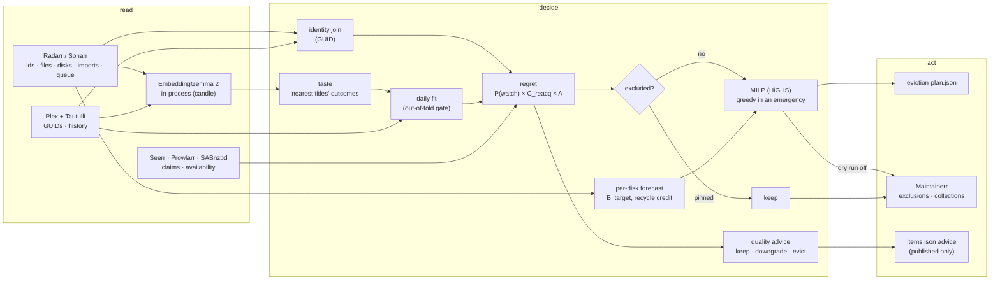

# How FLINCH works

The [README](../README.md) is the short version. This page is the long one: how
disks are measured, how items are matched across apps, how the forecast is
checked, and what every part of the stack is asked for.

## Storage governance: a forecast per disk

The daemon measures every disk that holds a library and forecasts each one a
window ahead. Every cycle forecasts afresh from the measurement and the logs.

```text
v        = EWMA_α(bytes imported per day, last 30 days)
U_proj   = U + v·W + queued bytes left − evictions not yet freed
B_target = max(0, U_proj − θ_target·C_max + headroom)
```

- **U** is the disk's used bytes; **C_max** its size, or
  `capacity.max_capacity_bytes` when that is smaller.
- **v** is the daily arrival rate from Radarr's and Sonarr's import history
  (read at most every 6 hours, cached in `arr-imports.json`), smoothed with
  α = 0.2.
- **Queued bytes left** come from their download queues; **evictions not yet
  freed** are the recycle-bin and held credit below.
- Defaults: W = 14 days, θ_target = 0.80, headroom = 50 GiB. All are in
  Settings → Storage (`settings.json` `capacity`).

B_target is what the plan must free on that disk. Zero on every disk means
healthy: the solver does not run. A disk at θ_emerg (0.95) or more *now* is an
emergency (see [The solver](#the-solver)).

What "a disk" means is taken seriously, because each mistake here deletes the
wrong thing:

- **Only library disks count.** `/api/v3/diskspace` lists every mount in the
  *arr container (`/`, `/config`, …); only the mounts that host a root folder are
  governed, so a full config volume never evicts media.
- **A root folder is checked against the disk it maps to.** Each app also
  reports the free space at the root folder itself; when that disagrees with
  the mount its path falls under, the folder lives on a disk the app does not
  list. (Seen live: Sonarr listed none of its three NFS mounts.) FLINCH then
  measures the disk itself: with `FLINCH_LIBRARY_PREFIX` set, the shares are
  mounted read-only in its own container at the app's paths under that prefix
  (`/library/data/media/tv`), and `statvfs` there gives the size and free
  space. A reading that disagrees with the app's free space is refused: the
  wrong share is mounted. A root neither can measure is reported as ungoverned,
  never measured against the container's `/`.
- **Per disk, never pooled.** Freeing the TV disk does not relieve a full movie
  disk; each item is attributed to its disk through its own app and path, and a
  share mounted at `/movies` in Radarr and `/tv` in Sonarr is recognised as one
  filesystem, so its target is not counted twice.
- **The recycle bin is credited.** Radarr/Sonarr delete into a recycle bin on the
  same disk, so freed space shows up late. FLINCH keeps a ledger of what it
  handed over and takes those bytes off the projection until the bin's window
  (read live from each app) passes and the disk shows them freed — otherwise
  every cycle in that window would evict a second batch for the same gap.
- **Freed space is checked, not assumed.** After an eviction's recycle-bin
  window, FLINCH checks that the disk dropped by the item's size, and keeps
  crediting the bytes for a 2-day grace. If no drop shows by then, the eviction
  is *held*: something else still holds the bytes, typically a torrent seeding
  the same hardlinked file, or a filesystem snapshot. Held bytes stay credited
  in the projection, so nothing more is evicted for them, and are reported, for
  up to 14 days after they were marked held or until the drop shows (then the
  credit ends). An eligible item on such a disk says why it waits: "held while
  /movies waits for space handed over earlier that the disk has not released".
  Downloads in flight can hide a drop for a while: the error is then a held
  report and less eviction, never more. Imports can fake one: the credit then
  ends at the window, as before.
- **Space that isn't library media is named.** Every disk line in the log and
  the Storage card say how much of the disk is neither library media nor an
  eviction FLINCH still credits: used − library − credited evictions, never
  below zero. Downloads, the recycle bins of other deletions and files no app
  tracks land there. It is shown before anything is evicted, because those
  leftovers are otherwise paid for with library titles.
- **More aggressive only on measured evidence.** An unmeasured disk or an
  unreadable app evicts *nothing*. An unreadable import history or queue counts
  as zero and is reported.
- **"Covered" and "met" are different claims.** The status says whether the
  eligible set *covers* a disk's target and how much is *handed* to Maintainerr
  so far; the target counts as met only once the handed bytes cover it, which
  grace runs and per-run caps pace over a few runs.

```bash
# The same forecast and plan, offline, against the checked-in fixture
./target/release/flinch-archive --cards fixtures/arr/cards.json --used-gb 820 --total-gb 1000 --ingest-gb-per-day 2
82.0% used, 848.0 GiB projected in 14 d: free 98.0 GiB
9 of 12 items selectable; plan takes 9 (22.8 GiB, regret 1.23) by Milp
  EVICT     5.77 GiB  Movie: Duplicate Pair A                   Watched 16 mo ago · P(watch) 1% · regret 0.02
  …
```

`--queue-gb`, `--target-pct`, `--emergency-pct`, `--window-days`,
`--headroom-gb` and `--grace-days` set the rest of the forecast;
`--never-played` lets unplayed items compete; `--plan out.json` writes the
manifest. It never deletes anything.

## The plan: least total regret

### Regret

```text
R = P(watch within 90 days) × C_reacq × A_household
```

- **P(watch)** comes from an exponential hazard, λ = λ₀·exp(β·x) and
  P = 1 − exp(−90·λ). The features are ln(1 + days since the last play)
  (never played: days on disk), ln(1 + finished viewings), ln(1 + plays of
  the show in the last 14 days), cos(2π·days since the last play / 365.25)
  for the film played every December, **finished** (1 when everyone who
  played it got to the end and nobody's latest play stopped short; see
  below), and **taste** (for a title nobody played: how readily the household
  plays titles like it, see [Taste](#taste-embeddinggemma-2)). The hand-set
  priors are λ₀ = 0.004/day and β = −0.5 (recency), 0 (viewings), +0.7 (show
  plays), +0.3 (annual cycle), −2.5 (finished), 0 (taste), set from this
  household's record: finished titles are almost never replayed, so a
  finished title is cold however recently it ended, and watching the show now
  is the strong signal. Under the priors a movie finished two days ago reads
  about 4%, below a download nobody opened in six weeks (about 5%); before
  the finished feature it read about 37%, because its own fresh play counted
  as demand. The [daily fit](#accuracy-you-can-check) replaces the priors only
  when it beats them. When a viewer with a play in the last 30 days is
  10–90% through the item, P is at least 0.95. It is the only probability
  FLINCH computes.
- **Finished** reads the plays per viewer. A movie is finished when every
  viewer's latest play reached 85% (Plex counted a view, or Tautulli streamed
  that much). A season is finished when every viewer who played it finished
  every episode that is still on disk, and their latest play was finished. A
  viewer who stopped halfway, however long ago, may come back, so one such
  viewer keeps the item unfinished. An item the media server marks as watched
  (a manual "mark as watched" writes no play) counts as finished unless a
  play says otherwise. Finishing only lowers P(watch): the route out (straight
  to deletion, or Leaving Soon first) is still decided by the watch state, as
  described under [Leaving Soon](#leaving-soon-nothing-unwatched-goes-without-a-warning-one-exception-see-known-limits).
- **C_reacq**, the cost to download it again, is
  max(0.1, 1 + 0.3·log₁₀(size / 1 GB) + 2 / max(seeders, 1) + 5·[no usenet copy
  within retention]). The seeders and retention terms count only when Prowlarr
  and SABnzbd supply them. With `streaming` on, a title that streams in
  `streaming.region` on one of `streaming.provider_ids` (TMDB's `flatrate`
  watch providers, data by JustWatch) keeps a quarter of its cost above the
  floor: 0.1 + 0.25·(C − 0.1). Its reason ends "streams on Netflix (DE)". A
  title not looked up yet, or whose lookup failed, gets no discount.
- **A_household** is 1 + the largest w·(2·[watchlisted] + 1.5·[requested])
  over Seerr users, with w from `planner.user_weights` (Seerr display name,
  default 1). The leading 1 keeps an item nobody claimed at P × C, not 0.

Each external source is best effort. One that is not configured or cannot be
read adds one line to the status problems and counts as no imports, no queue, no
claims, or no seeders and retention terms (see
[Integrations](#integrations-by-identity--never-by-title) for what each is
asked, and [deploy/README.md](../deploy/README.md#configure) to connect them).

### Taste (EmbeddingGemma 2)

Without it, every download nobody has opened looks the same to the hazard:
"never played, N days on disk". Taste says how readily this household plays
titles like it.

1. **One vector per title.** The daemon builds a text from content metadata
   only — Radarr/Sonarr and Plex: title, year, genres, overview, people,
   studio or network, rating, language, runtime, franchise — and embeds it
   with EmbeddingGemma 2's text encoder, run in-process on the CPU (a Rust
   port on candle whose vectors match the reference ONNX export to a cosine
   of 1.000000; a show's seasons share the show's vector). The text never
   holds anything about the household's viewing, so the vector cannot leak an
   outcome. Vectors are cached in `state/embeddings.json` and re-embedded only
   when the text, model revision or dimension changes, within a daily budget
   and two minutes per cycle. With Settings → Taste embeddings → Posters on,
   the text also holds the title's upstream poster (`Poster: <|image|>` after
   the title line): a candle port of the model's vision tower turns it into
   up to 280 soft tokens the text encoder reads in that place, so one vector
   describes words and artwork (reference parity: cosine 1.000000 on a PNG,
   0.99985 or better on JPEGs). Poster vectors are a space of their own
   (model id `…+posters`, recipe 2), so switching posters re-embeds every
   title; a poster that cannot be used leaves the text alone, never a gap.
   Setting it up:
   [deploy/README.md](../deploy/README.md#taste-embeddings-embeddinggemma-2).
2. **A nearest-neighbour classifier over the household's own outcomes.** The
   panel (see [Accuracy](#accuracy-you-can-check)) records, for each title and
   cut date, whether anything played it in the 90 days after, and who. For a
   title nobody played, taste takes the 20 most similar titles (cosine
   similarity) from other shows or films, weights each one's played share by
   its similarity, adds 2 pseudo-neighbours at the overall played rate, and
   reports the result as log-odds minus the overall log-odds: 0 means no
   evidence, negative means "titles like this sit unplayed here".
3. **Per viewer, warmest wins.** A household-wide share blurs its people: the
   one person who watches comedies can play every one while the comedies sit
   among a lot of horror nobody else touches. So taste is read for each
   active viewer (a Plex account or Tautulli user with a play in the year
   before the date asked about) from their own outcomes — a title counts as
   played by them if they played it in the 90 days, over the cut dates they
   were active at — against their own overall rate, and the household's taste
   is the warmest viewer's: someone here would watch it. A viewer counts only
   after playing at least 5 titles; when no active viewer has, the
   household-wide outcomes speak as above. Viewers are not merged across
   Plex and Tautulli: the same person seen by both is two viewers, which can
   only repeat their taste, never outvote anyone's.
4. **Leak-free.** A panel row at a cut date hears only outcomes whose 90 days
   had closed by that date, never its own show's, from the viewers active
   before that date. The daemon asks with the outcomes the adopted fit
   learned from, household-wide and per viewer, stored with it in
   `state/hazard.json`; a `hazard.json` from before per-viewer taste does not
   load, and the daemon refits on its next cycle.
5. **Gated like everything else.** Its prior weight is 0, so under the priors
   it moves nothing. It enters P(watch) only through the full fit, and only
   when that fit beats the priors out of fold. It speaks only for titles
   nobody played; once a title has plays, they say more.
6. **It says why.** Under an adopted fit, the plan reason of a never-played
   title with a nonzero taste names its two nearest neighbours that went the
   way the taste leans, titled from Radarr/Sonarr: `· like Hot Fuzz,
   Paddington (played here)` for a warm one (played by the viewer who
   speaks), `· like Hereditary, The Conjuring (unplayed here)` for a cold one
   (played by nobody).

Embedding switched off, a missing vector or an unread outcome record leaves
taste at 0, the household's average: absence is never read as dislike.

### Who competes

Every movie and season competes on regret alone, except:

- **Pinned:** a favorite, a keep collection, the keep tag (`flinch-keep` by
  default) as a Radarr/Sonarr tag or a Plex label or collection, or your own
  Maintainerr exclusion.
- **In its grace period:** on disk fewer than `planner.grace_period_days` (30).
- **Not matched in the media server:** nothing can warn about it or act on
  it: no Plex match (Maintainerr, or the native executor's Plex shelf), or no
  Jellyfin/Emby match when the native executor's shelf is on Jellyfin/Emby.
- **On no governed disk.**
- **No watch evidence:** no watch source reported on it.
- **Never played,** unless Settings → Planner → Never played is on. Even then
  it is held while a watch source was not read in full or the Leaving Soon
  title is blank.
- **Held by its torrents** (Settings → Torrents, off with no client): a
  torrent still seeding below its goal, a hardlink to a torrent that stays, or
  a client or links FLINCH could not read. See
  [Torrents](#torrents-seed-goals-and-hardlinks).
- **Kept by a rule** (Settings → Rules): see [Rules](#rules-hard-constraints-never-a-score).

- **Watch state is external and fail-closed.** *arr knows files; only the media
  server knows "watched". A movie counts as watched when Plex counted a view or
  Tautulli recorded a stream of at least 85%; a play that stopped sooner, or a
  stream whose percentage Tautulli could not report, counts as started, not
  watched. Where Plex's and Tautulli's records disagree, the newest decides, so
  a later start that Plex did not count outweighs an earlier finished play.
  Missing or partial evidence protects; it never deletes. Even with complete
  evidence, an item needs positive evidence: a watch source that reported on
  it and found no play. An item no source reported on is never reclaimed as
  unplayed, however large or old it is.
- **Days on disk start when the file arrived**, not when the title was
  requested.

Eviction safety, shown per item in the Movies and Series tables, gates
nothing: clamp((1 − P(watch)) − max(0, C_reacq − 1)/10, 0, 1), so it never
reads above 1 − P(watch). Neither does the [quality advice](#quality-advice-keep-downgrade-or-evict).

### Rules: hard constraints, never a score

0.3.0 removed a scoring rule engine: hand-tuned weights fought the regret
model and hid why an item left. Rules (`settings.json` `rules`, Settings →
Rules) change only what the plan *may* or *must* take; regret, P(watch) and
every reason stay the model's.

A rule has a name (unique; it names the rule wherever it acts), a scope and an
effect. Every scope condition set must hold, and a list holds when any entry
matches (names case-insensitively): kind (movie or season), *arr root folder
(the item's folder is it or below it), governed disk, *arr tag label, Plex
library section id, Seerr requester, theme, genre, quality (part of the *arr
quality name: `2160p` matches `Bluray-2160p`), size in GiB, days on disk,
played or never played, days since the last play, and P(watch). Ranges are
inclusive.

| Effect | What it does |
| --- | --- |
| `keep` | never selected; the item reads *Kept by rule “name”* |
| `keep_until` | the same, for `days` after the item was added, last played, or requested (by the scope's requesters when it names any; the latest such request counts) |
| `keep_latest_seasons` | keeps the newest `seasons` (1–100) seasons on disk of a continuing show (Sonarr `continuing` or `upcoming`), specials aside; silent on an ended show and on a movie |
| `keep_first_season` | keeps a show's first regular season (its lowest season number above 0, on disk or not), so it can always be started |
| `prefer_evict` | on its disk, no item without a rule is taken until every preferred one is; only as many as the target needs |
| `must_evict` | taken whenever its disk has a target at all, past the target if need be, with the seasons season order makes it follow |

- **Keep beats evict.** An item a keep and an evict rule both match stays,
  and the conflict is reported (status, log and preview). Must beats prefer.
- **Evict rules never override a safeguard.** They act only on an item the
  planner could already select: pinned, partway, in its grace period, not in
  Plex, without watch evidence, never played while that is off or held, or
  held by its torrents all still keep it. A forced item still leaves by its
  route, so one nobody finished goes through Leaving Soon. A disk with no
  target forces nothing. An evict rule needs a scope; one that would match
  the whole library is refused.
- **A missing fact keeps.** A condition FLINCH could not answer this cycle
  (tags unreadable, Seerr not configured or down, an undated request, a season
  — Sonarr reports no quality per season —, a title without a theme) is
  unknown: it lets a keep apply, never an evict, and the item counts as kept
  for a missing fact.
- **Rolling retention lets the rest compete.** A plain keep on a season
  anchors its show's order: kept S5 of a show nobody started blocks S1–S4,
  and kept S1 of a watched show blocks every later watched season. A season
  `keep_latest_seasons` or `keep_first_season` keeps for certain (and nothing
  else keeps or protects) leaves the order instead, so the older seasons go
  from the end (unplayed) or the start (played) around it. A show whose status
  Sonarr did not give is unknown, so it keeps the season.
- **Rules rank on top of the torrents' soft keep.** An item below the desired
  seed ratio (see Torrents) is spared before the rules; a rule that keeps,
  prefers or forces it replaces that, and one that says nothing leaves it.
- **Ignored viewers (`ignore_viewers`) count as nobody.** Their Plex history
  rows (by account name, from `/accounts`), Tautulli streams (by user),
  Jellyfin/Emby state (by user name), Tracearr plays (by username) and a Trakt
  source of that name are set aside right after each read, before evidence is
  derived or plays persisted, so `played`, last played, P(watch) and the
  fitter all see the household without them. Evidence health stays as read:
  an item only they played reads as never played where every source was read
  in full, and proves nothing where one was not. Setting rows aside can only
  shorten Tautulli's continuous coverage, never lengthen it. Plex's own item
  state belongs to the token's account and cannot be split by viewer; a
  viewer whose name a source does not give still counts.
- **Preview before saving.** Each cycle writes its pre-rule inputs to
  `state/plan-inputs.json`. `POST /api/rules/preview` with `{"rules": […]}`
  plans them under the saved rules and under the draft and returns the
  difference: items added to and removed from the plan (with why the other
  plan keeps each), both plans' items, bytes and regret, each rule's items and
  bytes, and the conflicts. It writes nothing; the Settings page saves a
  changed rule list only after previewing it.

### The solver

```text
min  Σ R_i·x_i
s.t. Σ_{i on disk d} Ŝ_i·x_i ≥ B̂_d   for every disk d with a target
     season order (below)
     x_i = 1                         for every must-evict item on a disk with a target
     x_j ≤ y_d ≤ x_p                 on a disk d with prefer-evict items p and others j
     x_i ∈ {0, 1}
```

Sizes Ŝ and targets B̂ are rounded up to `planner.quantum_mb` (100 MiB). HiGHS
solves it exactly. In an emergency, or if HiGHS fails, a greedy pass takes the
most bytes per unit of regret first, under the same order. The status names
the method: `milp`, `emergency` or `solver_fallback`. The greedy pass takes
must-evict items (and the seasons they depend on) first, then preferred ones,
then the rest; preference holds there only as far as season order allows.

- **Season order.** Within a show, unplayed seasons leave from the last one
  back, so the start of a show nobody began goes last. Played seasons leave
  from the first forward. A season that cannot go keeps every season due to
  leave after it: excluding season 5 of an unplayed show keeps seasons 1–4.
- **Plan order.** Items are listed so each follows the one it depends on, and
  the per-run caps never hand over a season before its predecessor.
- **The plan file.** `state/eviction-plan.json` is written every cycle, dry run
  or not: the forecast per disk, the target, the method, and each item with
  its size, regret and reason. Moves to the archive are listed apart, under
  `moves` (with `total_moved_bytes`), never among the items that leave.

### The archive tier: move instead of delete (off by default)

Settings → Archive (`archive.enabled`, `archive.radarr_root`,
`archive.sonarr_root`, `archive.max_moves_per_run`). Instead of deleting, a
movie or a whole series can move to an archive root folder on another disk,
where it stays playable. The solver gets a second decision per movie and per
series:

```text
min  Σ R_i·x_i + Σ c_g·m_g
s.t. Σ_{i on d} Ŝ_i·x_i + Σ_{g on d} Ŝ_g·m_g ≥ B̂_d   for every disk d with a target
     x_i + m_g ≤ 1                                   for every item i of group g
     Σ_{g to a} Ŝ_g·m_g ≤ H_a                         for every archive disk a
```

- **How much fits is the archive disk's own forecast.** `H_a` is what that
  disk can take while its projection stays under its target with its buffer
  (`θ·capacity − buffer − projected`, rounded down to whole quanta). A disk
  that must free bytes itself takes nothing. An archive root must be a root
  folder of its *arr on a disk FLINCH measures; one that is not archives
  nothing, and Settings → Archive names it.
- **A move costs almost nothing.** `c_g` is only the copy's IO
  (0.001 per TiB), so the plan fills the archive before it deletes anything,
  and spends the room on the items whose deletion would hurt most. An item
  whose regret is below even that still goes.
- **Sonarr moves whole series.** All seasons of a series move together, from
  one disk; seasons still evict one by one. A series moves only if every
  season could be selected at all.
- **Never round a keep.** Pinned items, anything someone is partway through,
  items already handed over and items under a rule never move; rules rank a
  move like an eviction (preferred items still go first, spared ones only once
  everything else on the disk is evicted or moved). The greedy pass mirrors
  it: ruled items count first, then moves by regret per byte while the archive
  has room, then evictions for the rest.
- **Acting.** Moves are FLINCH's own writes, under either executor. A move
  that stayed planned for the grace runs is sent, at most
  `max_moves_per_run` per cycle: `PUT /api/v3/movie/editor` or
  `PUT /api/v3/series/editor` with `rootFolderPath` and `moveFiles: true`.
  FLINCH reads the item back (`GET /api/v3/movie/{id}`, `/series/{id}`) and
  accepts the move only under the new root; the freed bytes are then credited
  to the old disk in the eviction ledger until the disk shows them (no recycle
  window applies), and the move is never announced as a deletion. A dry run
  prints each write and sends none. Streaks live in
  `state/archive-streaks.json`; `status.json` `archive` shows the
  destinations, their room, planned and sent moves.
- **Limit.** The rules preview re-plans without the archive tier.

### Hand-off

`planner.dry_run` is on by default (Settings → Planner → Dry run): the plan is
written and every Maintainerr write is printed, not sent. `FLINCH_DRY_RUN=1`
forces a dry run whatever the setting says. With dry run off, items that stay
selected for the grace runs join a collection, within the per-run caps.

FLINCH writes Maintainerr exclusions only for pinned items and for items
someone is partway through (unless the plan takes them). Everything else is
neither shielded nor evicted by FLINCH, so your own Maintainerr rules still
apply to it.

### The native executor (Settings → Executor)

`executor: "maintainerr"` is the default, so an existing install keeps working
unchanged. With `executor: "native"` FLINCH deletes without Maintainerr and
writes nothing to it; the operator's own Maintainerr exclusions still pin
their items while it is reachable (the last read stands in while it is not).
Grace runs count every cycle, since no Maintainerr has to be readable.

- **Finished or duplicated: deleted at once**, within the per-run caps
  (`max_items`, `max_gib`) and `native.max_deletes_per_run`.
- **Nobody finished it: announced first** on the Leaving Soon shelf (see
  [Leaving Soon](#leaving-soon-nothing-unwatched-goes-without-a-warning-one-exception-see-known-limits)),
  deleted once its window ran out, only while it is still picked, unplayed,
  and this cycle's watch history was read in full. An item without evidence
  this cycle is held on the shelf, neither deleted nor taken back.
- **A last look before every delete.** Plex's record of the item
  (`/library/metadata/{ratingKey}`) is read again right before the delete. A
  play since the decision (since the announcement for a shelf item), someone
  partway through it, an item Plex no longer lists, or a read that fails keeps
  it.
- **Deleting.** A movie: its file is deleted (`DELETE /api/v3/moviefile/{id}`)
  after it is unmonitored, or with `native.delete_mode: "remove_entry"` the
  movie leaves Radarr with its files (`DELETE /api/v3/movie/{id}?deleteFiles=true`,
  plus Radarr's import exclusion with `native.add_import_exclusion`). A
  season: it is unmonitored, then its episode files are deleted
  (`DELETE /api/v3/episodefile/bulk`); the show stays. Unmonitoring comes
  first, so nothing is downloaded again; a delete that fails monitors the item
  again. Each delete is read back, and only then booked in the eviction
  ledger, so the freed bytes are credited exactly as on the Maintainerr route
  (an announcement is booked as the hand-over).
- **After a delete.** With `native.seerr_cleanup` (on by default, needs
  `SEERR_URL`/`SEERR_API_KEY`) the title's Seerr record is cleared so it can
  be requested again: a movie's media record, or for a season only the
  requests for that season alone (a request that covers other seasons too is
  kept, as Maintainerr does). With `torrents.remove_after_delete` its
  torrents go too, with their data, once every item each one holds is gone
  and its seed goal allows (see Torrents).
- **Undo.** The Overview's executor card lists the native deletes of the last
  30 days with a Restore button (`POST /api/restore/{id}`): the daemon then
  monitors the movie or season again and asks Radarr or Sonarr to search (a
  removed movie is added back with its recorded quality profile and root
  folder). The new download is young, so the grace period keeps it for a
  while; set the keep tag if it must stay.
- **State.** `native.json` holds the shelf and the recent deletes; the
  undo queue is `restore/<item id>`, one empty file per request. A dry run
  reads everything, prints every write (Radarr, Sonarr, Plex, Seerr,
  torrents), records nothing, and leaves undo requests queued.

## Leaving Soon: nothing unwatched goes without a warning (one exception: see Known limits)

Every eviction leaves by one of two routes, chosen by why it is safe:

- **Finished or duplicated: straight to deletion.** A watched movie, a
  completed season nobody reopened, or a second copy goes to its kind's delete
  collection.
- **Nobody finished it: Leaving Soon first.** An item nobody finished joins a
  Maintainerr collection titled `Leaving Soon` (Settings → Collections).
  Plex shows it on the home screen, and Maintainerr
  deletes the item only after the collection's window. Play it during the
  window and FLINCH takes it back on the next cycle.
- **With the native executor.** FLINCH keeps the shelf itself: a regular Plex
  collection with the Leaving Soon title in each library, created with its
  first items and promoted to the library's recommended and home hubs. An item
  stays there for `native.leaving_soon_days` (14) and is deleted only if it is
  still picked and nobody played it; a play takes it back on the next cycle,
  and so does a pin, a plan that no longer picks it, or a renamed title (its
  window restarts in the new collection). An item someone took off the shelf
  in Plex is announced again with a fresh window, never deleted unannounced.
  Without Plex there is nowhere to warn: those items are held, exactly like a
  blank title.
- **Leaving Soon on Jellyfin/Emby (native, `native.leaving_soon_server:
  "jellyfin"`).** The shelf is one collection (BoxSet) on the server set in
  `jellyfin` (Jellyfin or Emby), created with its first items: `POST
  /Collections`, `POST`/`DELETE /Collections/{id}/Items` (Jellyfin's
  `CollectionController`, Emby's `CollectionService`), each write read back
  through the first administrator's item listing. Each card is placed by the
  server's own item id, kept from the catalogue-id join next to its Plex ids:
  the movie, or the Season its episodes name (a season whose episodes name
  different seasons is not announced). Seasons: Jellyfin's
  `CollectionManager` adds any item without a type check and jellyfin-web
  lists Season members under "Other items", so seasons are announced; this
  was read from the source, not tried on a live server, so a season the
  server does not keep fails the read-back and stays held. Jellyfin and Emby
  have no server-side home promotion: name the collection so it sorts first
  (e.g. "!Leaving Soon") or pin it in the client. A play by any Jellyfin user
  takes an item back, as Plex plays do, and the last look before a delete
  reads every Jellyfin user's state on the item (and Plex's, when Plex is
  also configured and the item matched there). Switching
  `leaving_soon_server` takes every shelved item back; its window restarts on
  the new server.
- **A dated shelf (native, Plex).** After each cycle FLINCH sorts its own
  members of the Plex shelf soonest-leaving first (the collection is switched
  to a custom order; members someone else added stay below) and writes the
  window into the collection's summary: "Leaves between Oct 14 and Oct 23".
  With household keep links on, their summary is written instead; it starts
  with the same line. A Leaving Soon collection FLINCH created and that has
  emptied is deleted (Plex never removes an empty collection); a collection
  FLINCH did not create, even with the same title, is never deleted.
- **Poster badges (opt-in, `native.poster_overlays`).** FLINCH draws a
  "LEAVES OCT 23" band across the bottom of each shelf member's current
  poster and uploads it as the selected poster. The poster that was selected
  before is recorded in `overlays.json` and selected again before the item
  leaves the shelf (taken back, kept or deleted) and for every item when the
  setting is turned off. A dry run prints each badge and restore and sends
  none. **Kometa conflict:** Kometa overlays also replace posters and keep
  their own record of the original. With both on, each overwrites the other's
  image, and a FLINCH restore can put back a Kometa-badged poster (or Kometa
  can re-badge an item FLINCH restored). Use one of the two for shelf items:
  leave `native.poster_overlays` off where Kometa manages overlays, or
  exclude the Leaving Soon collection from Kometa's overlay files.
- **A warning or nothing.** If the Leaving Soon title is blank, or the
  collection is missing, inactive, set to "Do nothing", hidden from Plex
  ("Keep in Maintainerr only" on, or neither "Show on Plex home" nor library
  recommended) or without a window ("Take action after days"), the status says
  so and the unwatched items wait. They are never sent to a delete collection
  instead. While the title is blank, never-played reclaim is held off too, so
  items nobody played never count toward a disk's target and watched items
  free the space instead. An item already waiting in a Leaving Soon
  collection that breaks later stays in it, and Maintainerr still acts on
  that collection's schedule. Clearing or renaming the title takes what waits
  in the old collection back out; those windows start over once the newly
  named one takes the items.
- **Out of a delete collection at once.** An unwatched item that FLINCH
  handed to a delete collection earlier, for example while it still counted
  as watched, is taken back out on the next cycle. It does not wait for its
  move to Leaving Soon, which the per-run caps may hold back. The same holds
  when the Leaving Soon title is also a delete collection's title and that
  collection does not warn (no window, or hidden from Plex). FLINCH takes out
  only memberships it recorded: an unwatched item in a delete collection
  without such a record (the record was lost in a restart, or someone else
  added it) is kept there by an exclusion instead, and the Maintainerr card
  names it until it is out of that collection. Then it goes to Leaving Soon.
- **One title, both libraries.** Make one collection per library, both titled
  `Leaving Soon`: the movie one of type *movie*, the TV one of type *season*.
  Each kind uses its own. A TV collection made with the *show* type is
  reported as the wrong type, and it never blocks movies. Turn **Use rules**
  off on both: FLINCH adds the items, and anything the group's own rules
  selected would be deleted by Maintainerr on its own.
- **A newcomer never restarts a window.** The next cycle's plan takes what
  Maintainerr already holds first, so a slightly cheaper newcomer cannot push
  an announced item back out and restart its window. The item table shows
  "Leaves Oct 7" once an item is handed over.
- **A change of collection is a move.** When an item belongs in another
  collection, for example after a collection title changed in Settings, FLINCH
  takes it out of the old collection and adds it to the new one. Its window
  restarts there, and the add counts against the per-run caps: a finished or
  duplicate item that does not fit yet stays in its old collection. An item
  nobody finished never waits unprotected outside Leaving Soon: FLINCH takes
  it out of any other collection it put it in at once, even while its add
  waits, and keeps it by an exclusion in a delete collection it has no record
  of adding it to (see *A warning or nothing* and *Out of a delete collection
  at once* above).

## Inflow: what is coming in that nobody is likely to watch

The cheapest byte is the one never downloaded. Each cycle FLINCH lists, as
advice in `status.inflow` and on the Overview card *Coming in, likely
unwatched* (`crates/flinch-archive/src/inflow.rs`):

- **Cold and unstarted**: a monitored, continuing Sonarr series of which no
  season was ever started by anyone, whose taste reads cold (log-odds below
  −0.5 against the household's played rate).
- **Abandoned**: a monitored series somebody started, last played over 180
  days ago, with a season not watched through or more still to air.
- **Cold request**: a not-declined Seerr request for a title Radarr or Sonarr
  already knows but has not downloaded (a movie without a file, a monitored
  show nobody started) whose taste reads cold. The requester is named.
- **Streams already** (with `streaming` on): such a request for a title that
  streams on a service you subscribe to: "requested by Ann, but it streams on
  Netflix (DE), a service you have". Checked before taste; unknown
  availability names nothing.

Taste here is the classifier of *Taste (EmbeddingGemma 2)* asked with the
adopted fit's outcomes, or, under the priors, with the household-wide record
of the current library (a title is played if any part of it ever was). It
is advice only and never feeds P(watch) from this path. Each suggestion
carries the mean on-disk size of the show's seasons as GiB per future season
and an action, e.g. "unmonitor future seasons in Sonarr". Fail-closed: a
title without a vector, or with no closed outcome to compare, is never called
cold; nothing of this writes unless the operator approves it (below).

Limits: a request's taste is the household's, not the requester's own;
requests for titles the *arrs do not know yet are skipped (no vector).

### Acting on inflow advice (off by default)

`inflow_actions` (Settings → Rules → Inflow actions,
`crates/flinch-archive/src/inflow/act.rs`) turns approved advice into *arr
writes, and only while a governed disk's forecast is over its target:

- **Unmonitor future seasons** of each Sonarr show the operator ticked in the
  approval list (`approved`, `sonarr-<id>`), while it is still suggested:
  `monitorNewItems: none`, and every regular season with no file unmonitored.
  Seasons on disk, specials and seasons whose statistics Sonarr did not send
  keep their monitoring. FLINCH never re-monitors; untick and re-tick a show
  to have it act again.
- **Import lists off**: each list ticked (`import_lists`, from what the daemon
  read from `/api/v3/importlist`) has its automatic add switched off (Sonarr
  `enableAutomaticAdd`, Radarr `enableAuto`), and switched back on once no
  disk is over target, the list is unticked or the feature is turned off. A
  list that was already off is left as it was and never switched on.

Each write is a `PUT` of the resource FLINCH just read, with only those
fields changed, then read back; only a confirmed write enters
`state/inflow-actions.json`, so a failed one is tried again next cycle. A dry
run prints each write and records nothing. `status.json` `inflow_actions`
lists the import lists, this cycle's writes and problems, the shows done and
the lists held off.

## Deletions FLINCH did not make

Files also leave through other doors: someone deletes a title in Radarr or
Sonarr, a script or Maintainerr's own rules use their API, or a file vanishes
from disk behind the app's back. The Overview lists those removals, so a gap
in the library has a name, and says which will download again.

- **From the *arr history.** FLINCH reads Radarr and Sonarr history once a day,
  so a removal can show up to a day late. The list covers the last 30 days,
  newest first, at most 50 entries. Each says whether it was deleted through
  the app (its UI, or anything holding its API key: a person, a script,
  Maintainerr's own rules), went missing from disk, or left some other way,
  and how many files left (a season counts each episode).
- **FLINCH's own are left out.** A removal counts as FLINCH's when FLINCH
  handed the item to Maintainerr no later than the removal. Hand-overs are
  remembered while FLINCH tracks the eviction and for 120 days after the
  hand-over, unless FLINCH took the item back. A move to another collection
  that lands in one run is not a take-back: the item keeps its first
  hand-over. An item nobody finished that is taken out before its Leaving Soon
  add lands counts as taken back; its next hand-over is when Leaving Soon
  takes it.
- **Monitored with nothing on disk will download again.** Each entry says
  whether the app still monitors the item (for a season: the show and the
  season both) and whether a file is back. Monitored with nothing on disk
  means Radarr or Sonarr will fetch it again. Turn on "Unmonitor Deleted
  Movies" in Radarr and "Unmonitor Deleted Episodes" in Sonarr (Settings →
  Media Management) so a file deleted outside FLINCH is not downloaded again.
- **Only deletions that left the entry behind.** Items the app no longer has
  are left out, and a movie removed from Radarr entirely takes its history
  with it, so it cannot be listed.
- **A report, nothing more.** FLINCH changes nothing in Radarr or Sonarr
  because of it.

## Duplicates: one copy is enough (off by default)

A movie Plex holds twice used to be *held*: Maintainerr acts on one copy, and
FLINCH could not tell which copy its evidence judged, so the item never
competed and nobody was told which copy wasted the space. With Settings →
Duplicates → Finder on, the Overview lists them, with the copy to keep.

- **What counts as a copy.** Plex versions of one movie (several `Media`),
  the same film in two libraries (merged by GUID), or the same TMDB id in two
  Radarr instances (copies are keyed by instance, so a second Radarr merges in
  when FLINCH reads one). Two versions sharing a file (one folder in two
  libraries) are one copy: removing either would remove both. A Plex file is
  Radarr's when the path matches, or the file name and size do (the two often
  mount the store under different roots).
- **Which copy stays.** First the one Radarr tracks (removing it would only
  download it again), then the one the household played (plays carry the
  ratingKey), then the picture: the highest, or HD over 4K when that is the
  preference or quality advice says downgrade. Size breaks ties.
- **Choose, then confirm.** Nothing is removed on a recommendation. The
  Overview stores the copy you choose in `state/dupes.json`; confirming the
  same copy afterwards is what lets FLINCH act, and only with **Remove** on. A
  choice made before a copy appeared or vanished no longer applies.
- **Removing.** A Plex version no *arr tracks goes through Plex
  (`DELETE /library/metadata/{ratingKey}/media/{mediaId}`, as python-plexapi's
  `Media.delete`; needs Settings → Library → "Allow media deletion"). A second
  Radarr's file goes through that Radarr (unmonitor, then `DELETE
  /api/v3/moviefile/{id}`). The kept copy is checked before and read back
  after each removal. The file the only Radarr tracks is never removed, nor
  any copy of a pinned item or one someone is partway through; a Radarr file
  that matches no Plex copy holds the whole group. At most `max_per_run`
  copies a run (default 3); a dry run prints each removal;
  `state/dupes-acted.json` keeps 30 days of outcomes, and a failed one is not
  tried again until you confirm again.
- **What changes for holds.** A confirmed choice of a Plex copy settles the
  item's "several copies" hold: the hand-off acts on the kept copy only.
- **Space nobody owns.** Folders under a Radarr or Sonarr root folder that no
  item owns (the *arrs' `unmappedFolders`), measured with their manual-import
  scan, are listed from `unowned_min_gib` (default 2 GiB), largest first, at
  most `unowned_max_folders` per app a run. Listed only: they may be yours.
- **Limits.** Movies only; a show's copies stay held. Plex does not say which
  version of one item was played, so plays only tell copies in different
  items apart.

## Torrents: seed goals and hardlinks

A download client keeps seeding after Radarr or Sonarr import, usually
through a hardlink to the library file. That changes two things about
deleting an item, and FLINCH reads qBittorrent (Web API v2) or Transmission
(RPC) every run to get both right. Off until a client is added in
Settings → Torrents.

- **Which torrents hold an item.** The *arr history already read once a day
  records each import's `downloadId`, which for a torrent client is the info
  hash. Per movie, and per episode of a season, the newest import's hash is
  the item's torrent: an upgrade's torrent replaces the old file's. An item
  the history ties to no listed torrent falls back to any torrent saved
  inside its own folder (a movie's folder; a season's show folder, so such a
  torrent holds every season of the show). Usenet downloads are ignored.
- **Seed goal.** A torrent has met its goal when it is complete and either
  its client's own share limit is reached (qBittorrent's effective ratio or
  seeding-time limit; Transmission's `isFinished`), or FLINCH's floor is: the
  minimum ratio (1.0) or the minimum days seeded (14), whichever comes first.
  With **Seed goals** on (the default), an item with a torrent below its goal
  is kept: *Seeding: ratio 0.42 after 3 days, below its seed goal*.
- **Desired ratio (soft).** `prefer_after_ratio` (Settings → Torrents →
  Desired ratio; 0, off, by default) is a ratio you would like, not one you
  must reach. An item no hold keeps whose torrent is below it is *spared*
  (`Force::Spare`): on its disk it is taken only once every other selectable
  item is, the prefer-evict switch inverted (`x_spared ≤ z ≤ x_other`; the
  greedy pass ranks it last). A rule that keeps, prefers or forces the item
  replaces that; pins, partway protection and Leaving Soon still apply.
  `status.json` `torrents.spared` counts them.
- **Bytes that stay.** A library file hardlinked to a torrent's file frees
  nothing when deleted while the torrent keeps its link. FLINCH counts such
  an item's size only when the torrent goes with it: under the native
  executor with **Remove after delete** on, for a torrent that met its goal
  and holds no other item. Otherwise the item is kept (*Hardlinked to a
  torrent that stays*) until the torrent is gone. A torrent's file is
  hardlinked when it shares its device and inode with a file under the
  item's library folder; flinch-arrd reads both through the path map (see
  [deploy](../deploy/README.md#torrents)). A copy frees its bytes and keeps
  nothing.
- **Missing evidence keeps.** A client that cannot be read keeps every item
  whose history names a torrent it might hold; links that cannot be read
  (no mount, a file list the client refused) keep the item unless its torrent
  goes with it.
- **Removal.** Only the native executor removes torrents, and only after its
  delete was verified: with their data, once each met its goal, never one
  that also holds an item that stays. Each removal is read back. A dry run
  prints it instead. FLINCH writes nothing else to a client.
- **Status.** Settings → Torrents → Status shows each client (host and port,
  how many torrents, or why it could not be read) and how many items and
  bytes each kind of hold kept on the last run (`status.json` `torrents`).

The shapes come from the clients' own references: qBittorrent's
[Web API wiki](https://github.com/qbittorrent/qBittorrent/wiki/WebUI-API-(qBittorrent-5.0))
and `serialize_torrent.cpp`, Transmission's
[`rpc-spec.md`](https://github.com/transmission/transmission/blob/main/docs/rpc-spec.md).
qBittorrent's login cookie (`SID`, or `QBT_SID_<port>` from 5.2) is sent
back as set, and a lapsed session logs in once more. Transmission's
`X-Transmission-Session-Id` handshake also names the RPC version: from 6
(Transmission 4.1) FLINCH speaks JSON-RPC 2.0 with snake_case keys, before
it the older protocol. Passwords come from environment variables named in
the settings; no URL or credential reaches a log, and redirects are not
followed.

## Notifications: telling the household, once

FLINCH can post what it did to Discord (channel webhook), ntfy (a topic), an
Apprise API notify endpoint, or any URL that takes a JSON POST
(Settings > Notifications). No channel is configured by default, and nothing
in a notification decides anything: every event is a fact the cycle already
published.

- **Leaving Soon.** Every item whose verified hand-over put it in the Leaving
  Soon window, with its size and when it goes, and a **Keep** link: with
  household links on (below), the no-login link `<FLINCH address>/r/<token>`;
  otherwise `<FLINCH address>/?item=<id>`, which opens the title in FLINCH
  with its detail open (playing it, or the keep tag, takes it back). Without
  a FLINCH address in Settings the message carries no link.
- **Deletions.** A hand-over to a delete collection, and an item the
  eviction ledger saw leave the library in the last two days.
- **Problems.** Watch evidence missing or partial, Maintainerr unreadable or
  a collection refused, a failed optional source (Seerr, Prowlarr, SABnzbd),
  the solver failing, a failed cycle — told once a problem has been seen on
  three cycles in a row. A cycle that failed early neither counts nor breaks
  the others' runs; a problem that clears and returns is told again. Their
  words stay generic: an error's own text can name a host.
- **Daily digest.** From the configured hour (UTC), once a day: each disk's
  use and its forecast for the window, what must be freed, what left the
  library in the last 24 hours, and the plan's first five picks. Sent in a dry
  run too, and says so.
- **Weekly newsletter** (`newsletter`; not ticked on a new channel: it is the
  household's, the others are the admin's). See below.

Each event has a key (an item's id and hand-over time, a problem's key and
when it began, the digest's day); a channel gets a key once, recorded in
`notify.json` only after the channel answered 2xx, so a failed post is retried
next run and a repeat run sends nothing new. Each channel gets at most
*N* messages an hour (default 12): one message per kind of event per run
(one POST of all events for a JSON webhook), and past the limit the rest wait
for a later run, never dropped. Redirects are not followed.

A Discord webhook URL is its own credential, so a channel names the
environment variable of flinch-arrd that holds its URL (and, for ntfy or a
webhook, an optional bearer token); a plain URL field is for URLs without a
secret, since it is stored in `settings.json` and shown in Settings. No
error, log line or status field carries a channel's URL or token. **Send
test** asks the daemon through the state volume (`notify-test.json`, answered
within seconds in `notify-test-result.json`), because only the daemon holds
the secrets; it tests the saved channels.

Shapes, from each service's documentation: Discord
[execute webhook](https://discord.com/developers/docs/resources/webhook#execute-webhook)
(one embed per message, mentions off except the requesters a household
message names; the newsletter adds a card per title); ntfy
[publish as JSON](https://docs.ntfy.sh/publish/#publish-as-json) to the server
root with the topic from the URL, Markdown on, up to three *view* buttons;
[Apprise API](https://github.com/caronc/apprise-api#api-details)
`{title, body, type, format: "markdown"}`; a JSON webhook gets
`{"source": "flinch", "events": [...]}`, each event tagged by `event`
(`leaving_soon`, `deleted`, `problem`, `digest`, `newsletter`) and a Leaving
Soon one with its `keep_url`, `requesters` and TMDB `poster` when known.

### The household: keep links, removal requests, requester messages (off by default)

Settings → Household. Three switches, each off until you turn it on.

**Keep and remove links.** A link is `<FLINCH address>/r/<token>`, where the
token is the request itself — the card id, `keep` or `remove`, an expiry,
and who it was addressed to — and an HMAC-SHA256 over it under
`FLINCH_WEB_LINK_SECRET` (both containers hold the same secret, 32+
characters; without it every link is refused). Nothing is stored when a link
is made; changing the card, the action or the expiry breaks the signature.
A link dies a day after its title's leave date (or after `link_days`, 14 by
default, when it has none) and is the same all day, so the shelf summary is
rewritten only when its titles change. The page needs no login: it shows the
title and one button, and the POST does what the token says. A second click
finds the request the first one made: a replay changes nothing.

- **Keep** acts at once, because keeping is always safe: the item is pinned
  (`Pinned: kept on request until …`) for `keep_days` (60 by default),
  protected like a favorite, so Maintainerr protects it and the native
  executor takes it off the shelf; the click wakes the daemon.
- **Remove** waits in the admin's queue (Overview → *Removal requests*).
  Approved, it becomes a `must_evict` rule for that one card (scope `ids`),
  which goes first when its disk needs space and never past a pin, someone
  partway through, missing evidence, the grace period or the Leaving Soon
  window. Removal links go only to a requester, for their own titles, in
  their copy of the newsletter.
- **Keep beats remove.** An active keep silences an approved removal, and
  the pin wins inside the rules engine anyway.

`requests.json` is written only by flinch-web (a click, your decision);
the daemon reads it each cycle. Decided and expired requests are kept 90
days; an open removal of a title that left the library is closed.

**The Leaving Soon summary.** With the native executor and links on, each
Plex shelf's summary lists its dates, then every title with its keep link,
soonest first (python-plexapi `editSummary`:
`PUT /library/sections/{id}/all?type=18&id={key}&summary.value=…&summary.locked=1`),
read back and written only when it changed. Maintainerr's own collection is
Maintainerr's to describe, so it gets no summary.

**Requester messages.** With *Tell requesters* on, a Leaving Soon line names
who requested the title in Seerr and a shared Discord message mentions them
(`<@id>`, with `allowed_mentions.users` so nobody else is pinged). Each
requester with an address of their own also gets their titles, with links
signed for them, on: an ntfy topic on the household's ntfy server; an
Apprise URL (any service Apprise supports, named by environment variable),
posted to the Apprise API's stateless `POST /notify/` with `urls`; or email,
through Apprise's `mailto://` with `to=` (the sender's SMTP login lives in
the variable you name; FLINCH carries no SMTP client). Recipients come from
Seerr's users (`GET /api/v1/user`: display name, email, Plex and Jellyfin
names); an override names a user by any of those and adds a Discord id, a
topic, an Apprise variable or another email, or mutes them. Seerr's emails
are used only with *Email every Seerr user* on. *Hide names* keeps names out
of shared messages and the newsletter and stops mentions; personal copies
still go. Each address files its sent events in `notify.json` like a
channel: once, within the hourly limit, retried after a failure.

**The newsletter**, weekly from the chosen day and hour (UTC; a daemon that
was down sends it later that week): what is leaving soon, soonest first,
with each title's TMDB poster (only `image.tmdb.org` URLs, resized; never a
Plex or *arr address, which would carry a token or point at a private host),
who asked for it and its keep link; and how much left in the last seven days.
A requester's copy adds their own titles still on disk with an *I'm done,
remove it* link. Discord shows a card per title with its poster (up to
nine), Apprise the posters as Markdown images, ntfy text only.

## Integrations, by identity — never by title

Titles are not identity ("Superman" is two films; a localized Plex title matches
nothing). Every join goes through catalogue ids:

| System | FLINCH reads | FLINCH writes |
| --- | --- | --- |
| **Radarr / Sonarr** | inventory with tmdb/tvdb/imdb ids, per-season file dates, each season's monitored flag, tags, root folders with their free space, disks, recycle-bin settings; import and removal history, once a day; imports of the last 30 days, every 6 hours; the download queue; with the TRaSH sync on, custom formats, quality profiles, the profile schema, quality definitions and (Radarr) languages | only what the operator switched on: with the TRaSH sync, the custom formats, quality profiles and quality sizes the operator applied (see [Quality profiles](#quality-profiles-the-trash-sync-off-by-default)); with the native executor, the deletes (movie file and unmonitor, or the movie entry; a season's episode files and its monitored flag) and their undo (monitor and search) |
| **Plex** | every library, paged, with `includeGuids`; each show's seasons with their episode counts (`/children`, because the section's own season listing leaves the counts out); full history; accounts; labels and collections named like the keep tag; episode GUIDs of a show whose season counts disagree; with the native executor, each item's `/library/metadata/{ratingKey}` right before its delete | with the native executor only: its Leaving Soon collection in each library (created with its first items, promoted to the library's recommended and home hubs), items added and taken back, its member order (custom sort, soonest-leaving first) and summary (the window's dates), deleted once empty if FLINCH created it; with `native.poster_overlays`, each member's poster (`thumb`) read, a badged copy uploaded and the original selected again |
| **Tautulli** | full history, paged, per user; each user's and library's `keep_history` switch | nothing |
| **Jellyfin / Emby** (optional) | every user; each user's movies, series and episodes with `ProviderIds` and that user's `UserData` (`Played`, `PlayCount`, `LastPlayedDate`, `PlaybackPositionTicks`), paged to the server's `TotalRecordCount` | nothing |
| **Tracearr** (optional, `watch_sources`) | public API v2: every user (`GET /api/v2/public/users`, removed ones included), each user's whole history (`GET /api/v2/public/history?user_id=…`, every cursor page), and each played show's catalogue ids (`GET /api/v2/public/media/{id}`), once per show | nothing |
| **Trakt** (optional, `watch_sources`) | one account's whole watched history per source (`GET /sync/history`, every page to `X-Pagination-Page-Count`) | nothing |
| **Maintainerr** | version, whether Seerr is configured, collections with their *arr action, windows, Plex visibility and "Force delete Seerr request", memberships, exclusions | exclusions for pinned items and items someone is partway through, collection adds for evictions (Leaving Soon or delete), release of its own exclusions for items proven gone — by Plex ratingKey |
| **Seerr** (optional) | every request that was not declined, users, each user's Plex watchlist; with the native executor, the deleted title's `mediaInfo` (`GET /api/v1/movie/{tmdbId}`, `/api/v1/tv/{tmdbId}`) | with the native executor and Seerr cleanup on: after a delete, `DELETE /api/v1/media/{id}` for a movie (or a show nobody requested), `DELETE /api/v1/request/{id}` for requests of that season alone |
| **Prowlarr** (optional) | one search per item, at most 20 per cycle, cached 7 days: the best-seeded torrent's seeders, the newest usenet post's age | nothing |
| **SABnzbd** (optional) | its servers' retention | nothing |
| **TMDB** (optional, `streaming`) | `GET /3/movie/{id}/watch/providers` and `/3/tv/{id}/watch/providers` for library titles and open requests, at most 40 per cycle, cached 7 days in `streaming.json`: the region's `flatrate` providers | nothing |
| **Discord / ntfy / Apprise / webhook** (optional) | nothing | notifications: one POST per kind of event per run, at most the hourly limit (see Notifications) |
| **qBittorrent / Transmission** (optional) | every torrent's hash, ratio, seeding time, share-limit state and content path; the file list of each torrent whose links decide anything | removal of a deleted item's torrent, by the native executor only (see Torrents) |

- **Plex ↔ *arr** join by GUID (`tmdb://`, `tvdb://`, `imdb://`). A season joins
  when Plex's episode count equals Sonarr's file count; when they differ, it
  joins only if TVDB episode ids show the same season. A season Plex sent
  without an episode count is left unresolved — never read as unwatched.
  Anything unresolved is never protected, scheduled, or treated as "never
  watched".
- **Tautulli's silence** counts as "never streamed" only where it keeps every
  stream: history read to its end, a stream within the last 60 days, and
  `keep_history` on for every active user and every library section a target
  lives in.
- **Jellyfin / Emby ↔ *arr** join by `ProviderIds`: a movie by its TMDB or
  IMDb id, an episode by its series' TVDB, TMDB or IMDb id and its season
  number. An id two library items share joins neither, and a season joins only
  when the server lists as many episode files as Sonarr holds (missing
  "virtual" episodes do not count). Every user is read, so the state is the
  household's, not one account's. Watch state is claimed — including "nobody
  played it" — only when every user was listed and every user's items were
  paged to the server's own total; a partial read keeps its dated plays and
  claims nothing else, and holds never-played reclaim off. Each user's
  `LastPlayedDate` becomes one play (viewer: the Jellyfin user id) for regret,
  rewatch and the fit (`jellyfin-plays.json`). The key is sent as a header
  (`Authorization: MediaBrowser Token=…` for Jellyfin, `X-Emby-Token` for
  Emby), never in a URL, and redirects are not followed.
- **Tracearr / Trakt ↔ *arr** join by the catalogue ids on every play: a
  movie by its TMDB or IMDb id, an episode by its *show's* TVDB, TMDB or IMDb
  id and its season number (Tracearr stamps an episode's own ids on the play,
  so its show's ids are read from Tracearr once per show). An id two library
  items share joins neither, and an episode numbered past the season's
  episode count joins nothing (the source orders that show differently from
  Sonarr). Titles are never used. Each play is a dated play for regret,
  rewatch and the fit (`watch-source-plays.json`), with the Tracearr user id
  or the Trakt source's name as its viewer, and makes the item played or
  partly played (a Tracearr play under 85 % of the runtime starts an item,
  never finishes it). Tracearr's silence counts as "never played" only when
  every user's history was read to its end, Tracearr recorded a play within
  the last 60 days, the item arrived after its record's latest unbroken run
  began (and inside `retention_days`, when the operator prunes history) at
  least 30 days ago, and the item has a catalogue id no other item shares —
  the same rule as Tautulli's silence, worth the same 0.7. Trakt proves plays
  only: nothing says every viewer scrobbles. A source that failed, or read
  only part of an account, holds never-played reclaim off. Tokens come from
  environment variables named in Settings, are sent only as
  `Authorization: Bearer`, and redirects are not followed.
- **Plays from before a library migration** join through Plex's own
  `plex://` GUIDs. When Plex re-adds media it gets new ratingKeys, but keeps the
  same `plex://movie/…` or `plex://episode/…` GUID, and Tautulli records that
  GUID with every play. Episode GUIDs come from each resolved show's
  `allLeaves`. They are fetched only while unjoined episode plays exist, and
  cached for 24 h in `episode-guids.json`. Legacy agent GUIDs and titles never
  join.
- **Maintainerr** is driven through a sync plan FLINCH can test: it owns
  exactly the exclusions and memberships it created, never touches an
  exclusion the operator made (it treats one as a pin), validates each
  collection, hands movies and seasons to their own collections within per-run
  caps, and verifies every write by reading it back. In a dry run it reads the
  live state and prints every write it would send.
- **Exclusions for gone items are released.** FLINCH releases the exclusions
  it created for an item only once it is proven gone: no file in this cycle's
  complete Radarr/Sonarr read, *and* absent from a complete Plex listing
  (every movie, show and season ratingKey Plex returned). An exclusion on an
  item Plex no longer holds can never stop a deletion, so releasing it is
  safe; anything short of that proof keeps it. Exclusions the operator made
  are never touched.
- **Season collections need an action Maintainerr runs.** A season collection
  must use *arr action 0, 2 or 5 ("Unmonitor and delete season", "Unmonitor
  and delete existing episodes", or the same and delete the show if empty).
  Maintainerr refuses "Unmonitor and delete all" (1) for seasons, so FLINCH
  reports it as a problem and hands that collection nothing.
- **Seerr requests are a warning, not a block.** With Seerr configured in
  Maintainerr, a collection FLINCH hands to whose "Force delete Seerr request"
  is off leaves the title's Seerr request behind until Seerr's availability
  sync notices, so it cannot be requested again at once. FLINCH warns and
  keeps handing over.
- **Who deletes is the executor's job.** With Maintainerr (the default)
  FLINCH deletes nothing in Radarr or Sonarr; what it writes there is opt-in
  (the quality-profile sync, quality actions). Maintainerr removes the movie
  from Radarr or unmonitors and deletes the season's episodes, removes the
  torrent with its data when seeding is done, rescans Plex, and removes the
  Seerr request when "Force delete Seerr request" is on. With the native
  executor FLINCH does it itself (see [The native executor](#the-native-executor-settings--executor)).
- **Secrets stay out of logs.** Plex and Tautulli take their token in the URL;
  FLINCH strips the URL from every error before printing the full cause.

## Quality advice: keep, downgrade or evict

Each item also gets advice on its quality, from the same P(watch), regret and
C_reacq the planner uses, first match wins:

- **Keep the original** when someone is partway through it, P(watch) ≥ 0.50,
  or regret ≥ 1.0.
- **Downgrade** when P(watch) ≥ 0.15 and the file is at least 15 GiB: a
  compact release is assumed to free about 80% of it.
- **Downgrade** a file over 25 GiB, or any 2160p movie, in a seldom-played
  theme (below), unless it is pinned, or P(watch) < 0.15 and C_reacq ≤ 3 so
  the last rule already makes it eligible for eviction.
- **Keep** when C_reacq > 3: it would be hard to get back.
- **Eligible for eviction** otherwise.

The advice is published (`items.json` `advice`, and the counts in
`status.json` `quality`). What quality profiles *are* belongs to Recyclarr or
to FLINCH's own TRaSH sync (below), whose built-in presets define a compact
profile to downgrade into.

### Quality profiles: the TRaSH sync (off by default)

Recyclarr's job, done where the disk forecast lives: with `trash.enabled` on
(Settings → Quality profiles (TRaSH)), the daemon reads the
[TRaSH-Guides](https://github.com/TRaSH-Guides/Guides/tree/master/docs/json)
custom formats (`docs/json/{radarr,sonarr}/cf`), quality profiles
(`quality-profiles`) and size tables (`quality-size`) at one pinned commit
(`trash.guide_commit`), and compares them with each *arr's
`/api/v3/customformat`, `/api/v3/qualityprofile` (and its `/schema`) and
`/api/v3/qualitydefinition`. The guide is fetched once per commit, through
GitHub's contents API and raw file host, and cached as
`state/trash-guide-<commit>.json`; any file that fails to arrive fails the
whole fetch, so a profile is never previewed without some of its formats.

**Preview always, write on request.** Every `trash.schedule_hours` (default
24), after a saved settings change, and on an apply, the daemon writes the
preview to `state/trash.json`: per app, each change with a stable id
(`radarr:cf:<trash id>`, `radarr:profile:<trash id>`, `radarr:sizes:movie`,
`radarr:cf-delete:<id>`), its field-by-field from → to, and what it needs
first (a new profile needs the formats it scores). The **Quality profiles**
tab shows it (`GET /api/trash/diff`); **Apply** posts the selection
(`POST /api/trash/apply`, ids from the current preview only), which the web
app leaves as `state/trash-apply.json` with a run trigger. The daemon applies
it at the top of its next cycle: custom formats, then profiles, then sizes,
then deletions. A live apply reads the app back and reports any change still
pending as unverified. With `trash.apply` on, every previewed change is applied
on schedule, as a Recyclarr cron would. The planner's dry run (or
`FLINCH_DRY_RUN=1`) builds every request and prints it instead
(`[dry-run] trash radarr: would POST /api/v3/customformat (…)`).

**What is matched, written and deleted.** A format or profile is matched by
the id FLINCH recorded when it created it, else by name, as Recyclarr adopts.
A profile update patches the object the app served (unknown fields survive);
its ladder lists every quality the app knows (qualities the profile does not
name stay, disabled, below it) and its scores every custom format, as Radarr
and Sonarr require. Scores layer like Recyclarr's: the guide's score for the
profile's score set, scaled by the profile's `score_multiplier`, then the
operator's override (`custom_formats` entries, per profile or all): `score`
replaces the guide's, `adjust_score` moves it by that much (Recyclarr #208);
with `reset_unmatched_scores` every other format scores 0. Custom formats FLINCH
created and no synced profile uses are offered for deletion, the operator's own
only with `trash.delete_unmanaged_custom_formats` on. With
`trash.delete_unused_profiles` on, a quality profile the sync does not manage
and no movie or series uses is offered too (`radarr:profile-delete:<id>`):
never one in use, none while any item's profile is unread or the library was
not read, never the quality actions' compact profile, and only when the
operator selects it (`trash.apply` never deletes a profile).

**Language preset.** `language { prefer: english | original | french,
fallback, fallback_penalty }` on an instance scores TRaSH's `Language: Not …`
format on every synced profile: -10000 (the guide's reject) without fallback;
with it, `-fallback_penalty` (default 1000, below 10000) and the profile's
minimum score lowered by the same amount, so every release taken before is
still taken and one in the preferred language ranks higher, while the guide's
-10000 formats stay rejected. Radarr profiles get language `Any`.

**What a change costs.** Each profile and size change in the preview carries a
GiB estimate (`impacts` in `state/trash.json`): for every item on the profile,
the cached Prowlarr release search (smallest and largest whole release) is
spread by how far the profile reaches, its cutoff quality's max size over the
table's largest; the change moves each item by spread × the change in reach,
items without a search counting at the mean. Beside it, the last plan's disk
forecast (projected use over capacity across the library volumes) before and
after. A size table that raises a quality's max is flagged: larger releases
become acceptable and upgrades may follow. Without a library read this cycle
there is no estimate.

**A Profilarr Compliant Database instead.** An instance with `source: pcd`
reads `trash.pcd` instead of TRaSH-Guides: a PCD repository and the schema it
builds on ([Dictionarry-Hub/schema](https://github.com/Dictionarry-Hub/schema)),
each at a pinned commit (default: the Dictionarry database, `v2` at
`faeeeae`, and schema `1.1.0`). Its `pcd.json` is read first and a database
that declares no license is not fetched; the Dictionarry database declares MIT,
its schema is MIT. The SQL ops (`ops/*.sql`, by number, schema first) are
replayed into an in-memory SQLite with ATTACH disabled and read into the same
model: profiles (ladder by position, cutoff where `upgrade_until` is set,
scores per profile), formats (conditions mapped to each app's specification
and enum values; a condition with no counterpart, such as indexer flags,
leaves the format out and the preview says why), language rules (`simple` is
Radarr's profile language; `must`/`only`/`not` become a format scored
-999999, as Profilarr does) and size tables. Rows carry names, so each gets a
32-hex id from its name; a configured id the source lacks lists the source's
`name = id` pairs in the preview. Cached as `state/trash-pcd-<commit>-<schema
commit>.json`. One source per instance: the other is not fetched.

**The built-in presets** carry what the Recyclarr companion config used to
ask for, each to save disk:

| App | Profile | Change from the guide | Why |
| --- | --- | --- | --- |
| Radarr | Remux 2160p (Combined) | upgrade until WEB 2160p / score 5000; minimum upgrade score 500; ladder WEB 2160p > Remux-1080p (disabled) > Bluray-1080p > WEB 1080p | 10000 is unreachable for a WEB release (a strong one scores about 5.2k), and a minimum of 1 lets a +5 repack re-download 20 GB; a movie without a 4K WEB release would otherwise grab a 20–40 GB remux and upgrade anyway |
| Radarr | WEB 1080p | minimum upgrade score 500; **compact** | the profile downgrades move into |
| Sonarr | WEB-2160p (Combined) | upgrade until WEB 2160p / score 2000; minimum upgrade score 250 | a strong WEB release scores about 2.3k |
| Sonarr | WEB-1080p | upgrade until WEB 1080p / score 2000; minimum upgrade score 250; **compact** | the profile downgrades move into |
| both | quality sizes | `movie` / `series` table, `preferred_ratio` 0.2 | ties go to the smaller release; it moves only the last tie-breaker, so it rejects nothing |

`preferred_ratio` places preferred at min + (max − min) × ratio, with max
capped at Radarr's 1999 or Sonarr's 995 MB/min, as Recyclarr computes it. The
compact profile's id is published in `state/trash.json`, for the quality
actions below; every profile the sync manages is listed there too, so the
upgrade guard leaves them alone.

### Acting on downgrade advice (off by default)

With `quality_actions.enabled` on (Settings → Quality → Downgrades), each
cycle moves items advised a downgrade to the compact profile and asks the *arr
to search: Radarr `PUT /api/v3/movie/editor {movieIds, qualityProfileId}` then
the `MoviesSearch` command; Sonarr `PUT /api/v3/series/editor` then one
`SeasonSearch` per season. The profile is read back before any search is
asked for; a move that does not read back is recorded as refused and tried
again a day later. The compact profile is the one the quality sync manages
(`state/trash.json`); without one, the profile named in
`quality_actions.radarr_profile` / `sonarr_profile`.

A profile move downgrades because a quality the new profile does not list
ranks lowest under it (`QualityProfile.GetIndex`), so any allowed release
replaces the file. A compact profile that lists the file's current quality
leaves it alone, and the record then says nothing smaller landed.

An item moves only when all of these hold:

- it is advised a downgrade, not pinned, nobody is partway through it, its
  watch evidence is in, no rule forbids or forces it out, and it is neither in
  this cycle's plan nor already handed over (never-played items qualify: the
  title stays);
- Prowlarr lists a whole release at least 30% smaller than the file (for a
  season, a season pack — never one episode; samples under 256 MiB are
  ignored), unless `require_smaller_release` is off. The size comes from the
  same budgeted searches the reacquisition signal makes, so a title waits until
  it has been searched;
- for a show, every season on disk is eligible: Sonarr keeps one profile per
  series, and a season advised to keep its original would follow it;
- it was never moved before (refused moves wait a day), and the day's cap
  (`max_per_day`, default 3, each season counting; a rolling 24 hours) has
  room. The biggest moves go first.

A dry run prints every write and records nothing. `state/quality-actions.json`
keeps each move for a year with its outcome: waiting, a smaller file landed
(at most 90% of the old size), nothing smaller within 14 days, or the item left
the library. `status.json` `quality_actions` carries this cycle's moves, the
waiting items with their reason, the newest records and the bytes given back.

### Upgrade searches (off by default)

Radarr and Sonarr search items below their profile's cutoff blindly; FLINCH
knows who will watch what and how much room each disk has. With
`upgrade_search.enabled` on (Settings → Quality → Upgrade searches), each
cycle reads every cutoff-unmet item (`GET /api/v3/wanted/cutoff?page=&pageSize=250&monitored=true`,
page by page, at most 40 pages per app: Radarr answers movies, Sonarr
episodes, grouped here by season) and asks a search for the likeliest watched
(highest P(watch)) first: Radarr `POST /api/v3/command {"name": "MoviesSearch",
"movieIds": [id]}`, Sonarr `{"name": "SeasonSearch", "seriesId", "seasonNumber"}`.

A search is asked only while the item's volume has headroom for the expected
growth: θ_target·C_max − U_proj − the headroom buffer must cover the largest
whole release Prowlarr lists minus the file, and each search this cycle spends
that headroom. An item without a Prowlarr size waits. Never searched: a pinned
item or one someone is partway through, one with C_reacq above 3, one the
upgrade-churn guard flags, one the plan evicts or handed over, and anything
beyond `upgrade_search.max_per_day` (default 5, 1–50; each season counts).

A dry run prints every command and records nothing. `state/upgrade-searches.json`
keeps each search for a year with its outcome: searching, reached its cutoff
(it left the cutoff-unmet list), nothing better within 14 days, left the
library, or refused (tried again a day later). An item is not searched again
for 30 days. A cutoff list that cannot be read in full settles nothing and
searches nothing that cycle. `status.json` `upgrade_search` carries this
cycle's searches, the waiting items with their reason, the newest records and
how many reached their cutoff.

### Upgrade churn

With `upgrade_guard.enabled` (on by default), the daemon reads each app's
grabs and imports of the last 30 days (`GET /api/v3/history/since`, event
types 1 and 3, every six hours, cached in `state/arr-grabs.json`) and flags
every item grabbed more than `max_grabs_per_item_30d` times (default 5). A
Sonarr season pack writes one record per episode; grabs count distinct
downloads, so a pack is one grab. `status.json` `upgrade_churn` lists them with
their grabs and imports.

`upgrade_guard.action` is `flag` by default. `unmonitor` unmonitors the movie,
or every episode of the season (`PUT /api/v3/episode/monitor`). `upgrades_off`
sets `upgradeAllowed` false on the item's profile, which stops upgrades for
every item on that profile; a profile the quality sync manages is skipped,
because the next sync would turn it back on. Each step is read back, taken once
per item within 90 days (`state/upgrade-guard.json`), and only printed in a
dry run.

### Themes: where the disk goes, and what nobody visits

Once a day, and whenever a taste vector changes, the daemon clusters the
vectors of every movie and show ([Taste](#taste-embeddinggemma-2)) with
spherical k-means: cosine similarity, k ≈ √(n/2) clamped to 4–24, k-means++
seeding from a fixed seed, ties to the lower index and at most 30 rounds, so
the same vectors always give the same themes. Fewer than 16 titles with a
vector make no themes. Each theme is named after the Radarr/Sonarr genres
its members carry most often (the second genre only when a third of the
members carry it); no language model is involved. Assignments are kept in
`state/themes.json`; each item row carries its theme (`items.json` `theme`).

Per theme, `status.json` `themes` publishes the bytes on disk, the titles
(a show counts once), the share of those anyone played in the last 365 days
(from the play log the cycle reads, a season counting its show's plays), and
the bytes this cycle's plan evicts. A theme of at least 5 titles under 10%
played is **seldom played**, and its large files get the downgrade advice
above, with the theme named in the reason.

Themes are advice and display only. They never touch regret, P(watch) or
the plan. A title without a vector has no theme and is never in a seldom-played
one, and when nothing in the library was played in the last year no theme is
called seldom played: missing evidence is not read as disinterest.

## Accuracy you can check

P(watch) is a question FLINCH can check against its own past: at monthly cut
dates back to 720 days, "given only the plays before then, did anyone play
this in the next 90 days?". Only cuts whose 90 days have fully passed count.
Presence at each date comes from the Radarr and Sonarr history, so a title
re-downloaded after a library migration still counts from when the household
first had it. The daemon builds that panel from the files it already publishes
and fits the hazard **once a day**. Every row is judged out of fold, in 4 folds
split by title, so no title is scored by a model fitted on it. Two candidates
compete, both fitted on the complementary log-log likelihood by Fisher
scoring:

- **Recalibrated priors.** ln λ = a + b·ln λ_prior: it keeps the priors'
  ranking and fits only how sure to be. It needs 40 rows and 2 of each
  outcome.
- **Full fit.** It relearns all 7 parameters, pulled toward the hand-set
  priors as if by 25 pseudo-observations. It needs 120 rows and 12 of each
  outcome. Only the full fit can give taste a weight.

Either also needs played outcomes from at least 2 titles, an out-of-fold AUC
(the C-index of the binary outcome) of at least 0.60 and no more than 0.02
behind the priors', and a Brier at least 0.005 better than the priors'. Of the
candidates that clear that gate, the one with the lower log-loss is adopted
and written to `state/hazard.json`, together with the closed outcomes its
taste was learned from; when a later fit falls short, the file is removed and
the priors run again. `state/fit.json` holds the last fit's report: the
candidate, its out-of-fold AUC, Brier and ECE beside the priors', and its
parameters. The UI's **Watch model** card shows it. A `hazard.json` or
`fit.json` written for another set of features does not load: the priors run
and the daemon refits on its next cycle.

```bash
flinch-fit --state-dir /state            # the same report, printed
flinch-fit --state-dir /state --json     # the fitted model as JSON
flinch-fit --state-dir /state --write    # and adopt it under the same gate
```

`--now <unix seconds>` pins the panel's date to reproduce a report.

## The web UI

`flinch-web` serves a React UI next to a JSON API over the files the daemon
publishes. Every API call needs either a session, which the browser gets by
logging in with `FLINCH_WEB_USERNAME` and `FLINCH_WEB_PASSWORD` or through
single sign-on, or the API key (`FLINCH_WEB_TOKEN`) that automations send. The only things it writes are
`settings.json`, the run trigger and the requests the daemon answers (a
quality-sync apply, a notification test): never the stack. It shows each disk
against its forecast and target, what is being freed, what is waiting on a
recycle bin, what is held and what isn't library media, every item's
P(watch), eviction safety, quality advice and decision in plain words, the
watch model's standing, the Maintainerr sync with its warnings, deletions
FLINCH did not make, evidence health, and a glossary for every term.

**Single sign-on.** With `FLINCH_WEB_OIDC_ISSUER`, `_CLIENT_ID` and
`_REDIRECT_URL` set, the login page shows **Sign in with <name>**.
`GET /api/oidc/login` sends the browser to the provider with the OpenID
Connect authorization code flow (a fresh `state` and `nonce`, PKCE `S256`);
`GET /api/oidc/callback` checks the state against the one this browser got
(a ten-minute, single-use, `SameSite=Lax` cookie), trades the code for
tokens, checks the ID token's signature against the provider's published
keys and its issuer, audience, expiry and nonce, reads email and groups from
userinfo, and opens a session only for an account named in
`_ALLOWED_SUBJECTS`, `_ALLOWED_EMAILS` (verified only) or `_ALLOWED_GROUPS`.
Nobody is allowed by default, and a failure keeps the browser out: the login
page says the sign-in failed or the account is not allowed, and the log says
which check failed without any code, token or identity. The session is the
password login's, `SameSite=Strict`; the callback reaches the UI through a
same-site page hop so that first load already carries it.

**Rules.** Settings → Rules lists the [rules](#rules-hard-constraints-never-a-score)
with a form per rule and a read-only YAML view of the list. **Preview
changes** posts the draft to `POST /api/rules/preview` and shows what would
leave and stay, each rule's items and bytes, items kept for a missing fact
and conflicts; a changed rule list saves only once previewed. Under the list,
the last run's `status.json` `rules` block says what the saved rules did.

**Quality profiles.** The tab lists the
[TRaSH sync](#quality-profiles-the-trash-sync-off-by-default)'s preview per
app, grouped into custom formats, quality profiles and quality sizes, each
change with a checkbox and its field-by-field from → to. Selecting a profile
selects the formats it needs. **Apply** queues the selection for the daemon;
the page follows it until the daemon publishes the outcome: applied and read
back, not confirmed, failed, or (in a dry run) the requests it printed.

**Storage by theme.** The Overview's theme card lists each
[theme](#themes-where-the-disk-goes-and-what-nobody-visits) largest first:
GiB on disk, titles, the share played in the last year and the GiB the plan
would evict, with seldom-played themes marked. The Series and Movies tables
filter by theme, and an item's details name its theme.

**Search by meaning.** The Series and Movies search box has two modes.
*Title* filters by name as you type. *Meaning* sends the words, on Enter, to
`GET /api/search?q=…&kind=movie|season&limit=50` (behind the login like
every API route), and the table shows the 50 titles whose description is
closest, best first; a column header re-sorts them and *Sort by relevance*
brings the ranking back. flinch-web embeds the query with the same
EmbeddingGemma 2 encoder on the weights the daemon downloaded
(`state/models/…`; flinch-web never downloads them), cuts it to the cached
vectors' dimensions and scores each item by cosine against
`state/embeddings.json`; a season scores as its show, and titles without a
vector yet are counted but not listed. Text-and-poster vectors are searched
like text-only ones: they sit in the same model's shared text and image
space (the probe below measured text-only ones). The encoder is opened on
the first search and kept, queries run one at a time off the async runtime,
and a query is at most 200 characters. With no weights, no vectors, or
vectors of another model revision the API answers 409 with what to switch
on. The query carries the model's retrieval prompt
`task: search result | query:` although the cached descriptions carry the
classification prompt: on 16
hand-labelled queries ("monster on a spaceship", "cooking competition",
"dinosaurs", …) over 15 classification-prompt descriptions, the retrieval
prompt ranked the intended title first 16 of 16 times at both 256 and 768
dimensions, the classification prompt 15 and 14 (it put a nature
documentary above Jurassic Park for "dinosaurs"), with narrower margins.
Search reads; it never changes the plan.

**Is it working?** The header says so on every tab: a green dot before
"Last run …" when the last cycle succeeded on schedule, red "Overdue" when no
cycle ran for twice the interval, red "Last run failed" with the error. Each
service after it gets a red dot, with the reason on hover, when the daemon
reported it unread, incomplete or not configured. **Trigger run** proves the
daemon itself is alive: "Last run" moves within seconds.

## Architecture in one pass


```mermaid
flowchart LR
    subgraph IN["read"]
        ARR["Radarr / Sonarr<br/>ids · files · disks · imports · queue"]
        PX["Plex + Tautulli<br/>GUIDs · history"]
        EXT["Seerr · Prowlarr · SABnzbd<br/>claims · availability"]
        EMB["EmbeddingGemma 2<br/>in-process (candle)"]
    end
    subgraph DECIDE["decide"]
        ID["identity join<br/>(GUID)"] --> REG["regret<br/>P(watch) × C_reacq × A"]
        REG --> EXC{"excluded?"}
        EXC -->|no| PLAN["MILP (HiGHS)<br/>greedy in an emergency"]
        EXC -->|pinned| KEEP["keep"]
        CAP["per-disk forecast<br/>B_target, recycle credit"] --> PLAN
        FIT["daily fit<br/>(out-of-fold gate)"] --> REG
        TASTE["taste<br/>nearest titles' outcomes"] --> FIT
        REG --> QA["quality advice<br/>keep · downgrade · evict"]
    end
    subgraph OUT["act"]
        EP["eviction-plan.json"]
        MX["Maintainerr<br/>exclusions · collections"]
        QA_OUT["items.json advice<br/>(published only)"]
    end
    ARR --> ID
    PX --> ID
    PX --> FIT
    EXT --> REG
    ARR --> EMB
    PX --> EMB
    EMB --> TASTE
    ARR --> CAP
    PLAN --> EP
    PLAN -->|dry run off| MX
    KEEP --> MX
    QA --> QA_OUT
```

The forecast decides how much goes, exclusions decide what may go, and regret
decides what goes.

## Several Radarr and Sonarr instances

FLINCH reads any number of Radarr and Sonarr instances beside the default
pair (up to eight extra per app): an HD Radarr beside a 4K one, an anime
Sonarr beside the rest. Extra instances come from **Settings → Instances** or
numbered environment variables (`RADARR_2_URL`, …; see
[deploy/README.md](../deploy/README.md#several-radarr-and-sonarr-instances)).
They are resolved every cycle, so a new one needs no restart. A broken extra
instance is logged and skipped; the default pair always stays.

- **Card ids.** The default instance keeps its ids: `radarr-<movieId>`,
  `sonarr-<seriesId>-s<season>`, a show `sonarr-<seriesId>`. A named instance
  adds `@<name>` to the app: `radarr@4k-<movieId>`,
  `sonarr@anime-<seriesId>-s<season>`, `sonarr@anime-<seriesId>`. Names are 1
  to 24 of `a-z`, `0-9` and `_` (never `-`), unique per app. An instance
  added by number alone is named by its number (`radarr@2`).
- **Everything is per instance.** Inventory, tags, history, imports and the
  queue, disks, archive moves (each instance has its own archive root, blank
  means it never archives), duplicates, inflow unmonitoring, quality moves
  (each its own compact profile), upgrade guard and searches, the TRaSH sync,
  native deletes, Seerr cleanup and restore all talk to the instance an item
  came from.
- **Disks.** A disk is a path as one instance reports it, so the same path in
  two instances counts as two disks, each with its own forecast and target.
- **TRaSH sync.** The trash config's `instances.extra` holds one entry per
  extra instance, keyed `radarr@<name>` or `sonarr@<name>`; an instance
  without an entry is not synced. Change ids for a named instance start
  `radarr@<name>:`.
- **HD and 4K copies share plays.** Two copies with the same catalogue ids
  (TMDB/TVDB/IMDb) resolve to the same Plex item, so a play of either copy
  counts for both cards; the join no longer reports them as ambiguous.
- **Links.** The UI opens a named instance at its public URL, or with none
  set at a sibling host of FLINCH named `<app>-<name>` (`radarr-4k`).

## Known limits

These can delete without a warning, in narrow cases:

- Plex's own item state (watched episodes over held episodes) can read a
  season as completed when Plex still holds a watched episode that was deleted
  from disk (its trash not emptied) and Sonarr has a new episode Plex has not
  scanned yet: the two cancel out. Plex's and Tautulli's play histories no
  longer have this flaw (see *Seasons count only episodes on disk* below).
- Episodes are matched by number: Plex's and Tautulli's episode number
  against Sonarr's. A season confirmed through TVDB episode ids whose
  numbering differs between Plex and Sonarr could match the wrong episodes.
- Native executor: the last look before a delete reads Plex's item state,
  which is the server admin's. A play by another account in the minutes
  between the cycle's history read and the delete is seen only on the next
  cycle, after the item is gone.
- Native executor: if Maintainerr still keeps a Plex collection with the same
  Leaving Soon title in a library, FLINCH finds it and uses it as its shelf,
  and Maintainerr's own sync may take FLINCH's items back out or act on them.
  Rename or remove Maintainerr's collection when switching. Switching the
  executor leaves Maintainerr's collections as they are: what FLINCH handed
  there earlier still leaves on Maintainerr's schedule unless you empty them.

**Seasons count only episodes on disk.** When a season on disk reads as
completed from Plex's or Tautulli's play history, the daemon asks Sonarr which
episode numbers have a file (`/api/v3/episode`, at most one read per series
per cycle, only for such series). The season reads completed only when every
episode on disk has a finished play: plays of episodes deleted outside FLINCH
(by hand, or by Plex's "Delete episodes after playing") no longer count, and a
play without an episode number never completes a season. When Sonarr cannot be
read, or its answer is incomplete (an unreadable row, a file without an
episode number, fewer numbers than files), the season reads 99% watched, not
completed: it goes through Leaving Soon and is never deleted unannounced. The
same numbers decide whether a season counts as finished for P(watch).

One makes eviction less careful: a Seerr, Prowlarr or SABnzbd that is missing
counts as no claim and no extra re-download cost, so items can look cheaper to
lose than they are. The status problems name each missing source.

For the native executor, missing or partial evidence keeps: without Plex an
item nobody finished is held and no delete is made at all (the last look
cannot be taken), an item without evidence this cycle is held on the shelf,
and an expired window waits while any watch source was read incompletely. A
removed movie can be added back by Restore only if its quality profile and
root folder were recorded at the delete.

The rest fail closed: the affected items are kept, never deleted.

- A root folder on a disk its app does not report, and that is not mounted
  under `FLINCH_LIBRARY_PREFIX` either, is never evicted. Sonarr's disk report
  leaves out NFS mounts, so TV disks need the mount (see
  [deploy](../deploy/README.md)).
- A file whose import the *arr history never recorded counts only from its
  current file date, and time on disk that the history proves but cannot date
  is left out.
- The freed-bytes check reads one number per disk, not the item's own files.
  A download in flight can hide a drop, so the eviction is reported held and
  less is evicted; an import can fake one, so the credit ends at the window,
  as it did before the check existed.
- Plays from before a Plex library migration join only through Tautulli's
  `plex://` GUIDs: Plex's own history rows carry none, and legacy agent GUIDs
  never join.
- A season whose episode counts differ between Plex and Sonarr stays
  unresolved when TVDB episode ids cannot confirm it.
- Plex keep labels are read on movies and shows, not on single seasons (a keep
  collection can hold a season).
- Rules scoped by quality never match a season (Sonarr reports no quality
  per season): a keep rule scoped by quality alone keeps every season, so
  scope it to movies. A request with no date in Seerr keeps its item under a
  `keep_until` after a request for good.
- Jellyfin and Emby keep no play history, only each user's *last* play of
  each item: a rewatch, earlier plays, stream lengths and plays of items
  removed from the server are invisible, so a Jellyfin household's regret
  sees fewer plays than a Plex + Tautulli one. A play needs a
  `LastPlayedDate`; an item marked played by hand counts as watched but
  undated. Jellyfin's Playback Reporting plugin keeps a full log; FLINCH does
  not read it.
- Trakt tokens are read, never refreshed: run Trakt's device flow
  (`POST /oauth/device/code`, then `POST /oauth/device/token`) for each
  household member and put the access token in the named variable; when it
  expires, the source fails (and holds never-played reclaim) until a new one
  is set. Trakt history has no stream lengths, so every Trakt play counts as
  finished.
- Keep labels and collections are Plex-only, and so is Leaving Soon on the
  Maintainerr route. With the native executor and
  `native.leaving_soon_server: "jellyfin"`, a Jellyfin/Emby household gets
  its own shelf; whether a BoxSet keeps Season members was read from Jellyfin's
  source, not tried on a live Emby or Jellyfin server (a dropped season is
  held). Jellyfin and Emby have no home promotion for the shelf.
- A Tautulli-only household (no Plex) resolves nothing by GUID.
- Several Radarr and Sonarr instances are read, but every instance's library
  must be readable or the cycle fails: one instance down stops the cycle, as
  one app down always did.
- Inflow's import-list toggles cover the default Radarr and Sonarr only.
- Renaming an instance changes its card ids, so its items look new to FLINCH.
- Quality actions move an item only when its whole compact copy is listed by
  Prowlarr's search, which runs on a budget, so a title waits until it has
  been searched. A compact profile that lists the file's current quality
  replaces nothing, and Sonarr moves a show only as a whole. A moved item
  stays on the compact profile whatever lands.
- While a named Leaving Soon collection is missing or broken, selected items
  nobody finished still count toward a disk's target and wait at the
  hand-off, so the disk can stay over its target until the collection is
  fixed; the Maintainerr card names the problem.
- Torrents: FLINCH sees only a torrent the *arr history names or one saved
  inside the item's folder. Any other (a cross-seed, a torrent added by hand
  elsewhere) is invisible: its item competes as if deleting freed its bytes,
  and the freed-bytes check then reports less freed. With Maintainerr as the
  executor FLINCH cannot tell whether a deletion also removes the torrent, so
  an item hardlinked to a torrent is kept until the torrent is gone. A
  torrent saved in a show's folder holds every season of the show.
  qBittorrent's "match all" share-limit mode reads as "any limit reached".
- The TRaSH sync reads the guide's profiles, custom formats and size tables,
  not its optional custom-format groups (`cf-groups`), quality-profile
  groups or naming schemes: add a group's formats under `custom_formats`.
  Quality-size caps are those of Radarr 5.9 and Sonarr 4.0.8 or later (2000
  and 1000 MB/min); an older app refuses larger values and the apply reports
  it failed. Two guide formats of one name, or an operator format named like
  a guide format, are matched by name, as Recyclarr does.
