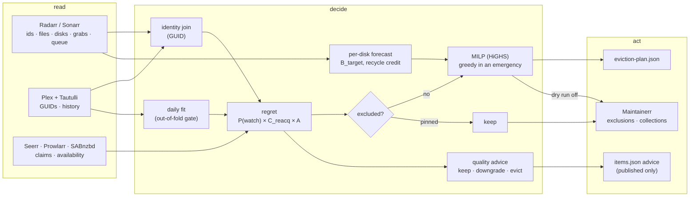

# How FLINCH works

The [README](../README.md) is the short version. This page is the long one: how
disks are measured, how items are matched across apps, how the forecast is
checked, and what every part of the stack is asked for.

## Storage governance: a forecast per disk

The daemon measures every disk that holds a library and forecasts each one a
window ahead. Every cycle forecasts afresh from the measurement and the logs.

```text
v        = EWMA_α(bytes grabbed per day, last 30 days)
U_proj   = U + v·W + queued bytes left − evictions not yet freed
B_target = max(0, U_proj − θ_target·C_max + headroom)
```

- **U** is the disk's used bytes; **C_max** its size, or
  `capacity.max_capacity_bytes` when that is smaller.
- **v** is the daily download rate from Radarr's and Sonarr's grab history
  (read at most every 6 hours, cached in `arr-grabs.json`), smoothed with
  α = 0.2.
- **Queued bytes left** come from their download queues; **evictions not yet
  freed** are the recycle-bin and held credit below.
- Defaults: W = 14 days, θ_target = 0.80, headroom = 50 GiB. All are in
  Settings → Storage (`settings.json` `capacity`).

B_target is what the plan must free on that disk. Zero on every disk means
healthy: the solver does not run. A disk at θ_emerg (0.95) or more *now* is an
emergency (see [The solver](#the-solver)).

What "a disk" means is taken seriously, because each mistake here deletes the
wrong thing:

- **Only library disks count.** `/api/v3/diskspace` lists every mount in the
  *arr container (`/`, `/config`, …); only the mounts that host a root folder are
  governed, so a full config volume never evicts media.
- **A root folder is checked against the disk it maps to.** Each app also
  reports the free space at the root folder itself; when that disagrees with
  the mount its path falls under, the folder lives on a disk the app does not
  list, and it is reported as ungoverned instead of measured against the
  container's `/`. (Seen live: Sonarr listed none of its three NFS mounts.)
- **Per disk, never pooled.** Freeing the TV disk does not relieve a full movie
  disk; each item is attributed to its disk through its own app and path, and a
  share mounted at `/movies` in Radarr and `/tv` in Sonarr is recognised as one
  filesystem, so its target is not counted twice.
- **The recycle bin is credited.** Radarr/Sonarr delete into a recycle bin on the
  same disk, so freed space shows up late. FLINCH keeps a ledger of what it
  handed over and takes those bytes off the projection until the bin's window
  (read live from each app) passes and the disk shows them freed — otherwise
  every cycle in that window would evict a second batch for the same gap.
- **Freed space is checked, not assumed.** After an eviction's recycle-bin
  window, FLINCH checks that the disk dropped by the item's size, and keeps
  crediting the bytes for a 2-day grace. If no drop shows by then, the eviction
  is *held*: something else still holds the bytes, typically a torrent seeding
  the same hardlinked file, or a filesystem snapshot. Held bytes stay credited
  in the projection, so nothing more is evicted for them, and are reported, for
  up to 14 days after they were marked held or until the drop shows (then the
  credit ends). An eligible item on such a disk says why it waits: "held while
  /movies waits for space handed over earlier that the disk has not released".
  Downloads in flight can hide a drop for a while: the error is then a held
  report and less eviction, never more. Imports can fake one: the credit then
  ends at the window, as before.
- **Space that isn't library media is named.** Every disk line in the log and
  the Storage card say how much of the disk is neither library media nor an
  eviction FLINCH still credits: used − library − credited evictions, never
  below zero. Downloads, the recycle bins of other deletions and files no app
  tracks land there. It is shown before anything is evicted, because those
  leftovers are otherwise paid for with library titles.
- **More aggressive only on measured evidence.** An unmeasured disk or an
  unreadable app evicts *nothing*. An unreadable grab history or queue counts
  as zero and is reported.
- **"Covered" and "met" are different claims.** The status says whether the
  eligible set *covers* a disk's target and how much is *handed* to Maintainerr
  so far; the target counts as met only once the handed bytes cover it, which
  grace runs and per-run caps pace over a few runs.

```bash
# The same forecast and plan, offline, against the checked-in fixture
./target/release/flinch-archive --cards fixtures/arr/cards.json --used-gb 820 --total-gb 1000 --ingest-gb-per-day 2
82.0% used, 848.0 GiB projected in 14 d: free 98.0 GiB
9 of 12 items selectable; plan takes 9 (22.8 GiB, regret 1.23) by Milp
  EVICT     5.77 GiB  Movie: Duplicate Pair A                   Watched 16 mo ago · P(watch) 1% · regret 0.02
  …
```

`--queue-gb`, `--target-pct`, `--emergency-pct`, `--window-days`,
`--headroom-gb` and `--grace-days` set the rest of the forecast;
`--never-played` lets unplayed items compete; `--plan out.json` writes the
manifest. It never deletes anything.

## The plan: least total regret

### Regret

```text
R = P(watch within 90 days) × C_reacq × A_household
```

- **P(watch)** comes from an exponential hazard, λ = λ₀·exp(β·x) and
  P = 1 − exp(−90·λ). The features are ln(1 + days since the last play)
  (never played: days on disk), ln(1 + finished viewings), ln(1 + plays of
  the show in the last 14 days), and cos(2π·days since the last play / 365.25)
  for the film played every December. The hand-set priors are λ₀ = 0.004/day
  and β = −0.5 (recency), 0 (viewings), +0.7 (show plays), +0.3 (annual
  cycle), set from this household's record: finished titles are almost never
  replayed, so finishing earns nothing, and watching the show now is the strong
  signal; the [daily fit](#accuracy-you-can-check) replaces them only when it
  beats them. When a viewer with a play in the last 30 days is 10–90% through
  the item, P is at least 0.95. It is the only probability FLINCH computes.
- **C_reacq**, the cost to download it again, is
  max(0.1, 1 + 0.3·log₁₀(size / 1 GB) + 2 / max(seeders, 1) + 5·[no usenet copy
  within retention]). The seeders and retention terms count only when Prowlarr
  and SABnzbd supply them.
- **A_household** is 1 + the largest w·(2·[watchlisted] + 1.5·[requested])
  over Seerr users, with w from `planner.user_weights` (Seerr display name,
  default 1). The leading 1 keeps an item nobody claimed at P × C, not 0.

Each external source is best effort. One that is not configured or cannot be
read adds one line to the status problems and counts as no grabs, no queue, no
claims, or no seeders and retention terms (see
[Integrations](#integrations-by-identity--never-by-title) for what each is
asked, and [deploy/README.md](../deploy/README.md#configure) to connect them).

### Who competes

Every movie and season competes on regret alone, except:

- **Pinned:** a favorite, a keep collection, the keep tag (`flinch-keep` by
  default) as a Radarr/Sonarr tag or a Plex label or collection, or your own
  Maintainerr exclusion.
- **In its grace period:** on disk fewer than `planner.grace_period_days` (30).
- **Not matched in Plex:** Maintainerr could not act on it.
- **On no governed disk.**
- **No watch evidence:** no watch source reported on it.
- **Never played,** unless Settings → Planner → Never played is on. Even then
  it is held while a watch source was not read in full or the Leaving Soon
  title is blank.

- **Watch state is external and fail-closed.** *arr knows files; only the media
  server knows "watched". A movie counts as watched when Plex counted a view or
  Tautulli recorded a stream of at least 85%; a play that stopped sooner, or a
  stream whose percentage Tautulli could not report, counts as started, not
  watched. Where Plex's and Tautulli's records disagree, the newest decides, so
  a later start that Plex did not count outweighs an earlier finished play.
  Missing or partial evidence protects; it never deletes. Even with complete
  evidence, an item needs positive evidence: a watch source that reported on
  it and found no play. An item no source reported on is never reclaimed as
  unplayed, however large or old it is.
- **Days on disk start when the file arrived**, not when the title was
  requested.

Eviction safety, shown per item in the Movies and Series tables, gates
nothing: clamp((1 − P(watch)) − max(0, C_reacq − 1)/10, 0, 1), so it never
reads above 1 − P(watch). Neither does the [quality advice](#quality-advice-keep-downgrade-or-evict).

### The solver

```text
min  Σ R_i·x_i
s.t. Σ_{i on disk d} Ŝ_i·x_i ≥ B̂_d   for every disk d with a target
     season order (below)
     x_i ∈ {0, 1}
```

Sizes Ŝ and targets B̂ are rounded up to `planner.quantum_mb` (100 MiB). HiGHS
solves it exactly. In an emergency, or if HiGHS fails, a greedy pass takes the
most bytes per unit of regret first, under the same order. The status names
the method: `milp`, `emergency` or `solver_fallback`.

- **Season order.** Within a show, unplayed seasons leave from the last one
  back, so the start of a show nobody began goes last. Played seasons leave
  from the first forward. A season that cannot go keeps every season due to
  leave after it: excluding season 5 of an unplayed show keeps seasons 1–4.
- **Plan order.** Items are listed so each follows the one it depends on, and
  the per-run caps never hand over a season before its predecessor.
- **The plan file.** `state/eviction-plan.json` is written every cycle, dry run
  or not: the forecast per disk, the target, the method, and each item with
  its size, regret and reason.

### Hand-off

`planner.dry_run` is on by default (Settings → Planner → Dry run): the plan is
written and every Maintainerr write is printed, not sent. `FLINCH_DRY_RUN=1`
forces a dry run whatever the setting says. With dry run off, items that stay
selected for the grace runs join a collection, within the per-run caps.

FLINCH writes Maintainerr exclusions only for pinned items and for items
someone is partway through (unless the plan takes them). Everything else is
neither shielded nor evicted by FLINCH, so your own Maintainerr rules still
apply to it.

## Leaving Soon: nothing unwatched goes without a warning (one exception: see Known limits)

Every eviction leaves by one of two routes, chosen by why it is safe:

- **Finished or duplicated: straight to deletion.** A watched movie, a
  completed season nobody reopened, or a second copy goes to its kind's delete
  collection.
- **Nobody finished it: Leaving Soon first.** An item nobody finished joins a
  Maintainerr collection titled `Leaving Soon` (Settings → Maintainerr
  collections). Plex shows it on the home screen, and Maintainerr
  deletes the item only after the collection's window. Play it during the
  window and FLINCH takes it back on the next cycle.
- **A warning or nothing.** If the Leaving Soon title is blank, or the
  collection is missing, inactive, set to "Do nothing", hidden from Plex
  ("Keep in Maintainerr only" on, or neither "Show on Plex home" nor library
  recommended) or without a window ("Take action after days"), the status says
  so and the unwatched items wait. They are never sent to a delete collection
  instead. While the title is blank, never-played reclaim is held off too, so
  items nobody played never count toward a disk's target and watched items
  free the space instead. An item already waiting in a Leaving Soon
  collection that breaks later stays in it, and Maintainerr still acts on
  that collection's schedule. Clearing or renaming the title takes what waits
  in the old collection back out; those windows start over once the newly
  named one takes the items.
- **Out of a delete collection at once.** An unwatched item that FLINCH
  handed to a delete collection earlier, for example while it still counted
  as watched, is taken back out on the next cycle. It does not wait for its
  move to Leaving Soon, which the per-run caps may hold back. The same holds
  when the Leaving Soon title is also a delete collection's title and that
  collection does not warn (no window, or hidden from Plex). FLINCH takes out
  only memberships it recorded: an unwatched item in a delete collection
  without such a record (the record was lost in a restart, or someone else
  added it) is kept there by an exclusion instead, and the Maintainerr card
  names it until it is out of that collection. Then it goes to Leaving Soon.
- **One title, both libraries.** Make one collection per library, both titled
  `Leaving Soon`: the movie one of type *movie*, the TV one of type *season*.
  Each kind uses its own. A TV collection made with the *show* type is
  reported as the wrong type, and it never blocks movies. Turn **Use rules**
  off on both: FLINCH adds the items, and anything the group's own rules
  selected would be deleted by Maintainerr on its own.
- **A newcomer never restarts a window.** The next cycle's plan takes what
  Maintainerr already holds first, so a slightly cheaper newcomer cannot push
  an announced item back out and restart its window. The item table shows
  "Leaves Oct 7" once an item is handed over.
- **A change of collection is a move.** When an item belongs in another
  collection, for example after a collection title changed in Settings, FLINCH
  takes it out of the old collection and adds it to the new one. Its window
  restarts there, and the add counts against the per-run caps: a finished or
  duplicate item that does not fit yet stays in its old collection. An item
  nobody finished never waits unprotected outside Leaving Soon: FLINCH takes
  it out of any other collection it put it in at once, even while its add
  waits, and keeps it by an exclusion in a delete collection it has no record
  of adding it to (see *A warning or nothing* and *Out of a delete collection
  at once* above).

## Deletions FLINCH did not make

Files also leave through other doors: someone deletes a title in Radarr or
Sonarr, a script or Maintainerr's own rules use their API, or a file vanishes
from disk behind the app's back. The Overview lists those removals, so a gap
in the library has a name, and says which will download again.

- **From the *arr history.** FLINCH reads Radarr and Sonarr history once a day,
  so a removal can show up to a day late. The list covers the last 30 days,
  newest first, at most 50 entries. Each says whether it was deleted through
  the app (its UI, or anything holding its API key: a person, a script,
  Maintainerr's own rules), went missing from disk, or left some other way,
  and how many files left (a season counts each episode).
- **FLINCH's own are left out.** A removal counts as FLINCH's when FLINCH
  handed the item to Maintainerr no later than the removal. Hand-overs are
  remembered while FLINCH tracks the eviction and for 120 days after the
  hand-over, unless FLINCH took the item back. A move to another collection
  that lands in one run is not a take-back: the item keeps its first
  hand-over. An item nobody finished that is taken out before its Leaving Soon
  add lands counts as taken back; its next hand-over is when Leaving Soon
  takes it.
- **Monitored with nothing on disk will download again.** Each entry says
  whether the app still monitors the item (for a season: the show and the
  season both) and whether a file is back. Monitored with nothing on disk
  means Radarr or Sonarr will fetch it again. Turn on "Unmonitor Deleted
  Movies" in Radarr and "Unmonitor Deleted Episodes" in Sonarr (Settings →
  Media Management) so a file deleted outside FLINCH is not downloaded again.
- **Only deletions that left the entry behind.** Items the app no longer has
  are left out, and a movie removed from Radarr entirely takes its history
  with it, so it cannot be listed.
- **A report, nothing more.** FLINCH changes nothing in Radarr or Sonarr
  because of it.

## Integrations, by identity — never by title

Titles are not identity ("Superman" is two films; a localized Plex title matches
nothing). Every join goes through catalogue ids:

| System | FLINCH reads | FLINCH writes |
| --- | --- | --- |
| **Radarr / Sonarr** | inventory with tmdb/tvdb/imdb ids, per-season file dates, each season's monitored flag, tags, root folders with their free space, disks, recycle-bin settings; import and removal history, once a day; grabs of the last 30 days, every 6 hours; the download queue | nothing today (see Recyclarr) |
| **Plex** | every library, paged, with `includeGuids`; each show's seasons with their episode counts (`/children`, because the section's own season listing leaves the counts out); full history; accounts; labels and collections named like the keep tag; episode GUIDs of a show whose season counts disagree | nothing |
| **Tautulli** | full history, paged, per user; each user's and library's `keep_history` switch | nothing |
| **Maintainerr** | version, whether Seerr is configured, collections with their *arr action, windows, Plex visibility and "Force delete Seerr request", memberships, exclusions | exclusions for pinned items and items someone is partway through, collection adds for evictions (Leaving Soon or delete), release of its own exclusions for items proven gone — by Plex ratingKey |
| **Seerr** (optional) | every request that was not declined, users, each user's Plex watchlist | nothing |
| **Prowlarr** (optional) | one search per item, at most 20 per cycle, cached 7 days: the best-seeded torrent's seeders, the newest usenet post's age | nothing |
| **SABnzbd** (optional) | its servers' retention | nothing |

- **Plex ↔ *arr** join by GUID (`tmdb://`, `tvdb://`, `imdb://`). A season joins
  when Plex's episode count equals Sonarr's file count; when they differ, it
  joins only if TVDB episode ids show the same season. A season Plex sent
  without an episode count is left unresolved — never read as unwatched.
  Anything unresolved is never protected, scheduled, or treated as "never
  watched".
- **Tautulli's silence** counts as "never streamed" only where it keeps every
  stream: history read to its end, a stream within the last 60 days, and
  `keep_history` on for every active user and every library section a target
  lives in.
- **Plays from before a library migration** join through Plex's own
  `plex://` GUIDs. When Plex re-adds media it gets new ratingKeys, but keeps the
  same `plex://movie/…` or `plex://episode/…` GUID, and Tautulli records that
  GUID with every play. Episode GUIDs come from each resolved show's
  `allLeaves`. They are fetched only while unjoined episode plays exist, and
  cached for 24 h in `episode-guids.json`. Legacy agent GUIDs and titles never
  join.
- **Maintainerr** is driven through a sync plan FLINCH can test: it owns
  exactly the exclusions and memberships it created, never touches an
  exclusion the operator made (it treats one as a pin), validates each
  collection, hands movies and seasons to their own collections within per-run
  caps, and verifies every write by reading it back. In a dry run it reads the
  live state and prints every write it would send.
- **Exclusions for gone items are released.** FLINCH releases the exclusions
  it created for an item only once it is proven gone: no file in this cycle's
  complete Radarr/Sonarr read, *and* absent from a complete Plex listing
  (every movie, show and season ratingKey Plex returned). An exclusion on an
  item Plex no longer holds can never stop a deletion, so releasing it is
  safe; anything short of that proof keeps it. Exclusions the operator made
  are never touched.
- **Season collections need an action Maintainerr runs.** A season collection
  must use *arr action 0, 2 or 5 ("Unmonitor and delete season", "Unmonitor
  and delete existing episodes", or the same and delete the show if empty).
  Maintainerr refuses "Unmonitor and delete all" (1) for seasons, so FLINCH
  reports it as a problem and hands that collection nothing.
- **Seerr requests are a warning, not a block.** With Seerr configured in
  Maintainerr, a collection FLINCH hands to whose "Force delete Seerr request"
  is off leaves the title's Seerr request behind until Seerr's availability
  sync notices, so it cannot be requested again at once. FLINCH warns and
  keeps handing over.
- **All deleting stays in Maintainerr.** FLINCH never writes to Radarr or
  Sonarr. Maintainerr removes the movie from Radarr or unmonitors and deletes
  the season's episodes, removes the torrent with its data when seeding is
  done, rescans Plex, and removes the Seerr request when "Force delete Seerr
  request" is on.
- **Secrets stay out of logs.** Plex and Tautulli take their token in the URL;
  FLINCH strips the URL from every error before printing the full cause.

## Quality advice: keep, downgrade or evict

Each item also gets advice on its quality, from the same P(watch), regret and
C_reacq the planner uses, first match wins:

- **Keep the original** when someone is partway through it, P(watch) ≥ 0.50,
  or regret ≥ 1.0.
- **Downgrade** when P(watch) ≥ 0.15 and the file is at least 15 GiB: a
  compact release is assumed to free about 80% of it.
- **Keep** when C_reacq > 3: it would be hard to get back.
- **Eligible for eviction** otherwise.

The advice is published only (`items.json` `advice`, and the counts in
`status.json` `quality`). Recyclarr owns what quality profiles *are*, so FLINCH
never writes a profile or moves an item between them. The companion config,
[`deploy/recyclarr/recyclarr.flinch.yml`](../deploy/recyclarr/recyclarr.flinch.yml),
defines a compact profile to downgrade into.

## Accuracy you can check

P(watch) is a question FLINCH can check against its own past: at monthly cut
dates back to 720 days, "given only the plays before then, did anyone play
this in the next 90 days?". Only cuts whose 90 days have fully passed count.
Presence at each date comes from the Radarr and Sonarr history, so a title
re-downloaded after a library migration still counts from when the household
first had it. The daemon builds that panel from the files it already publishes
and fits the hazard **once a day**. Every row is judged out of fold, in 4 folds
split by title, so no title is scored by a model fitted on it. Two candidates
compete, both fitted on the complementary log-log likelihood by Fisher
scoring:

- **Recalibrated priors.** ln λ = a + b·ln λ_prior: it keeps the priors'
  ranking and fits only how sure to be. It needs 40 rows and 2 of each
  outcome.
- **Full fit.** It relearns all 5 parameters, pulled toward the hand-set
  priors as if by 25 pseudo-observations. It needs 120 rows and 12 of each
  outcome.

Either also needs played outcomes from at least 2 titles, an out-of-fold AUC
(the C-index of the binary outcome) of at least 0.60 and no more than 0.02
behind the priors', and a Brier at least 0.005 better than the priors'. Of the
candidates that clear that gate, the one with the lower log-loss is adopted
and written to `state/hazard.json`; when a later fit falls short, the file is
removed and the priors run again. `state/fit.json` holds the last fit's
report: the candidate, its out-of-fold AUC, Brier and ECE beside the priors',
and its parameters. The UI's **Watch model** card shows it.

```bash
flinch-fit --state-dir /state            # the same report, printed
flinch-fit --state-dir /state --json     # the fitted model as JSON
flinch-fit --state-dir /state --write    # and adopt it under the same gate
```

`--now <unix seconds>` pins the panel's date to reproduce a report.

## The web UI

`flinch-web` serves a React UI next to a JSON API over the files the daemon
publishes. Every API call needs either a session, which the browser gets by
logging in with `FLINCH_WEB_USERNAME` and `FLINCH_WEB_PASSWORD`, or the API key
(`FLINCH_WEB_TOKEN`) that automations send. The only things it writes are
`settings.json` and the run trigger: never the stack. It shows each disk
against its forecast and target, what is being freed, what is waiting on a
recycle bin, what is held and what isn't library media, every item's
P(watch), eviction safety, quality advice and decision in plain words, the
watch model's standing, the Maintainerr sync with its warnings, deletions
FLINCH did not make, evidence health, and a glossary for every term.

**Is it working?** The header says so on every tab: a green dot before
"Last run …" when the last cycle succeeded on schedule, red "Overdue" when no
cycle ran for twice the interval, red "Last run failed" with the error. Each
service after it gets a red dot, with the reason on hover, when the daemon
reported it unread, incomplete or not configured. **Trigger run** proves the
daemon itself is alive: "Last run" moves within seconds.

## Architecture in one pass


```mermaid
flowchart LR
    subgraph IN["read"]
        ARR["Radarr / Sonarr<br/>ids · files · disks · grabs · queue"]
        PX["Plex + Tautulli<br/>GUIDs · history"]
        EXT["Seerr · Prowlarr · SABnzbd<br/>claims · availability"]
    end
    subgraph DECIDE["decide"]
        ID["identity join<br/>(GUID)"] --> REG["regret<br/>P(watch) × C_reacq × A"]
        REG --> EXC{"excluded?"}
        EXC -->|no| PLAN["MILP (HiGHS)<br/>greedy in an emergency"]
        EXC -->|pinned| KEEP["keep"]
        CAP["per-disk forecast<br/>B_target, recycle credit"] --> PLAN
        FIT["daily fit<br/>(out-of-fold gate)"] --> REG
        REG --> QA["quality advice<br/>keep · downgrade · evict"]
    end
    subgraph OUT["act"]
        EP["eviction-plan.json"]
        MX["Maintainerr<br/>exclusions · collections"]
        QA_OUT["items.json advice<br/>(published only)"]
    end
    ARR --> ID
    PX --> ID
    PX --> FIT
    EXT --> REG
    ARR --> CAP
    PLAN --> EP
    PLAN -->|dry run off| MX
    KEEP --> MX
    QA --> QA_OUT
```

The forecast decides how much goes, exclusions decide what may go, and regret
decides what goes.

## Known limits

One of these can delete without a warning:

- A season whose watched episodes were deleted outside FLINCH (by hand, or
  by Plex's "Delete episodes after playing") while its unwatched ones stay on
  disk can read as completed. Plex's and Tautulli's play histories still
  count the finished plays of the episodes that are gone, against the files
  that are left, so every file looks watched. The season can then leave
  through its delete collection with no Leaving Soon warning, unwatched
  episodes included. Until a fix counts only the episodes on disk, keep
  watched episodes on disk, or keep such a season with the keep tag on its
  show or with a keep collection.

One makes eviction less careful: a Seerr, Prowlarr or SABnzbd that is missing
counts as no claim and no extra re-download cost, so items can look cheaper to
lose than they are. The status problems name each missing source.

The rest fail closed: the affected items are kept, never deleted.

- A root folder on a disk its app does not report is never evicted until the
  app reports it. On the homelab FLINCH was built on, Sonarr's disk report left
  out all three of its NFS mounts (Radarr listed its own), so TV there is not
  governed.
- A file whose import the *arr history never recorded counts only from its
  current file date, and time on disk that the history proves but cannot date
  is left out.
- The freed-bytes check reads one number per disk, not the item's own files.
  A download in flight can hide a drop, so the eviction is reported held and
  less is evicted; an import can fake one, so the credit ends at the window,
  as it did before the check existed.
- Plays from before a Plex library migration join only through Tautulli's
  `plex://` GUIDs: Plex's own history rows carry none, and legacy agent GUIDs
  never join.
- A season whose episode counts differ between Plex and Sonarr stays
  unresolved when TVDB episode ids cannot confirm it.
- Plex keep labels are read on movies and shows, not on single seasons (a keep
  collection can hold a season).
- A Tautulli-only household (no Plex) resolves nothing by GUID.
- One Radarr and one Sonarr instance are supported.
- Quality advice is published only: moving an item to another quality
  profile is your step, and it can trigger a re-download.
- While a named Leaving Soon collection is missing or broken, selected items
  nobody finished still count toward a disk's target and wait at the
  hand-off, so the disk can stay over its target until the collection is
  fixed; the Maintainerr card names the problem.
